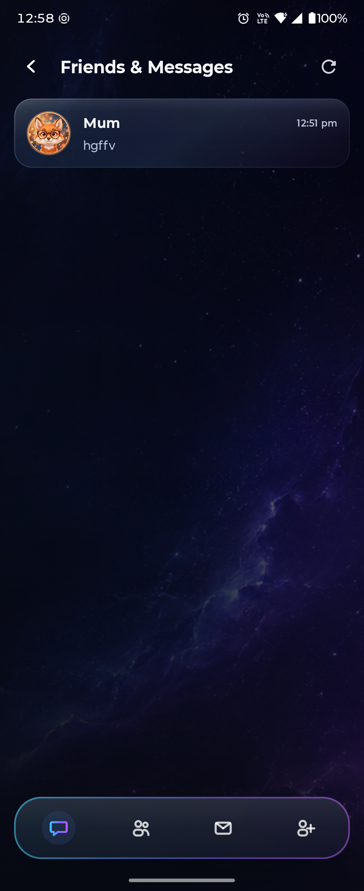
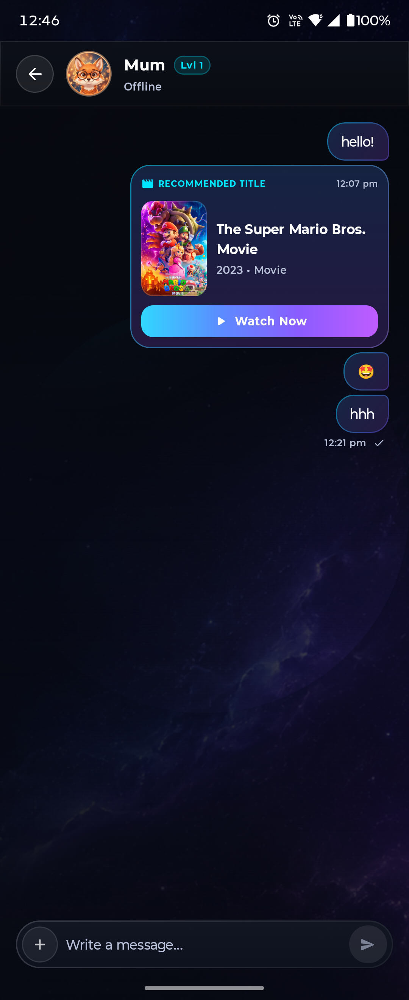
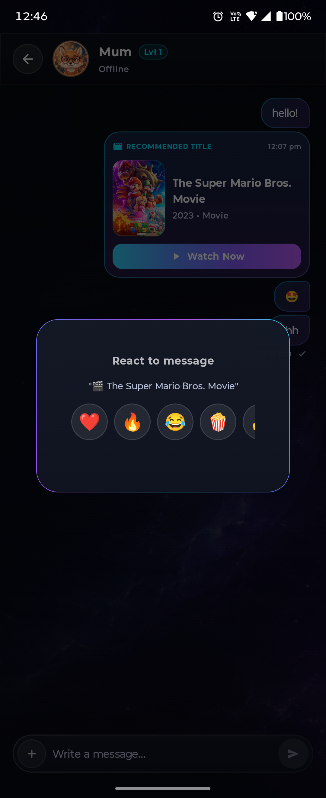
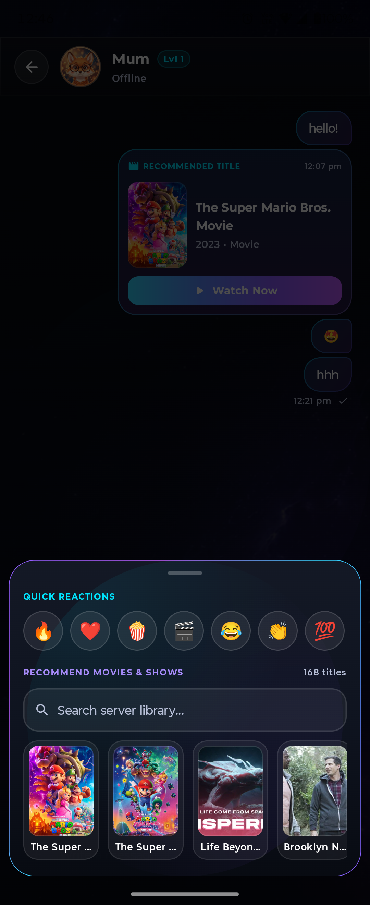
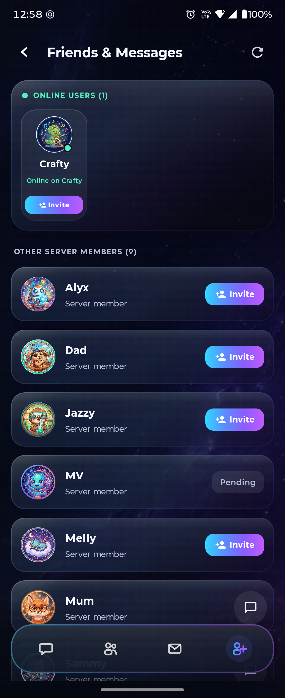
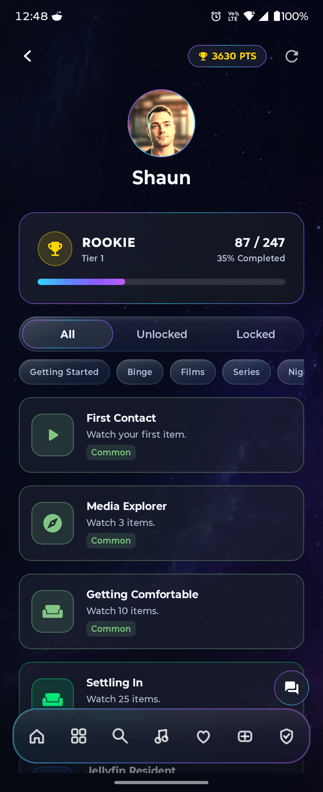
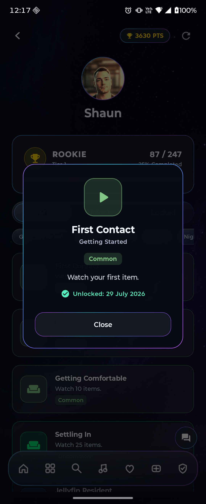
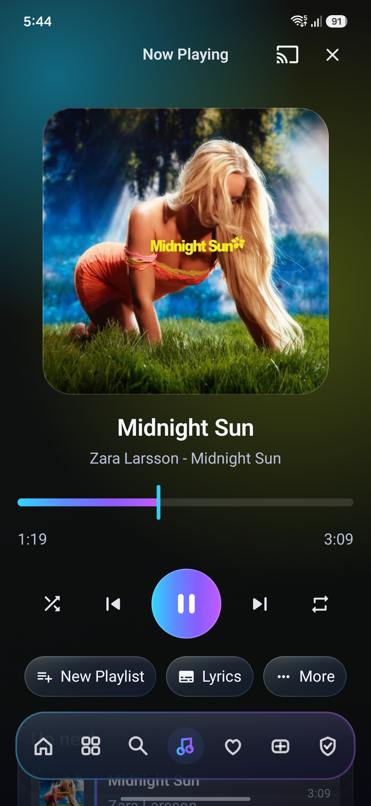
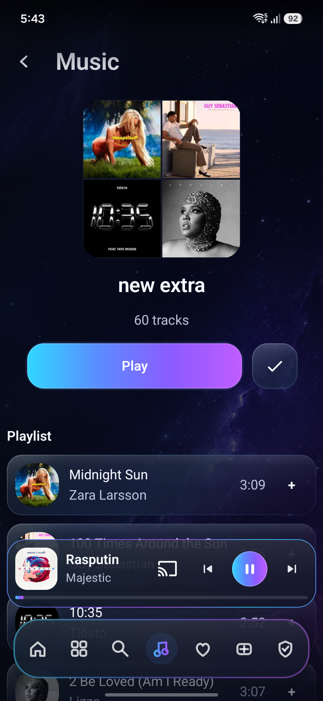
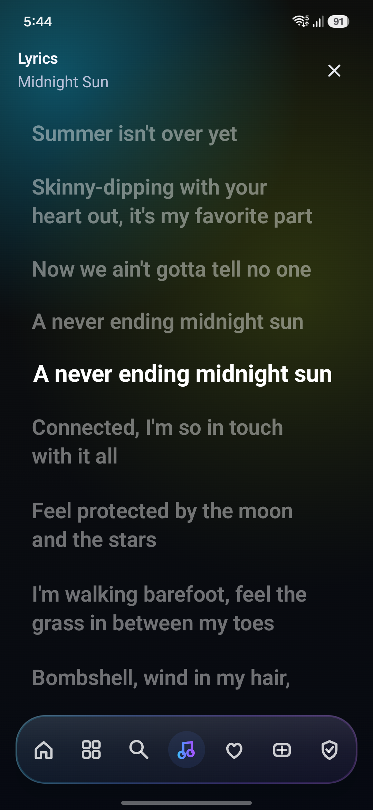

<p align="center">
  
</p>

<h1 align="center">Vantafyn</h1>

<p align="center">
  <strong>A premium, fluid Android & Android TV client for <a href="https://jellyfin.org">Jellyfin</a>.</strong><br>
  Built with Jetpack Compose, AndroidX Media3, dynamic glassmorphism, and offline-first capabilities.
</p>

<p align="center">
  <a href="LICENSE"></a>
  
  <a href="https://github.com/glowseedstudio/Vantafyn/actions/workflows/build.yml"></a>
  <a href="https://kotlinlang.org/"></a>
  <a href="https://developer.android.com/jetpack/compose"></a>
  <a href="https://developer.android.com/guide/topics/media/media3"></a>
  <a href="https://jellyfin.org/"></a>
  
</p>

---

## 🎬 Live Demo & Motion

<p align="center">
  <a href="assets/vantafyn_demo.mp4">
    
  </a>
  <br>
  <em>(Click above or <a href="assets/vantafyn_demo.mp4">click here to watch / download the full 1080p demo video</a>)</em>
</p>

---

## 📖 About The Project

**Vantafyn** was born out of a desire to make a personal Jellyfin server feel indistinguishable from a top-tier streaming platform: calm visual design, rich backdrop artwork, ultra-smooth motion, real-time server synchronisation, rock-solid video/audio playback, true offline downloads, gamified achievement progression, native social messaging, and advanced administration tools.

I am a solo developer working on Vantafyn in my spare time as a passion project. What began strictly as a personal media client has matured into an expansive, modular suite that is now proud to be open-sourced to the Jellyfin and Android communities.

---

## 🤖 AI Assistance Disclosure

**Vantafyn is an AI-assisted software project.**

I want to be completely transparent about that. I have been developing software for around six years, and rather than building every part of Vantafyn entirely by hand and burning myself out, I use AI coding tools as part of my development workflow.

AI is primarily used to accelerate tasks such as:
- Initial scaffolding and boilerplate
- Basic feature implementation
- Repetitive development work
- Exploring possible solutions

**This does not mean Vantafyn is blindly generated or "vibe coded."**

I review all code that goes into the project, understand how it works, debug issues myself, manually optimise and refactor where necessary, and make all of the architectural, technical, UI, and product decisions behind the application.

> **AI is an assistant, not the developer.**

*Vantafyn is AI assisted, human directed, human reviewed, and human maintained.*

---

## 📸 Screenshots & UI Showcase

### 🏠 Discovery & Media Playback
<table align="center">
  <tr>
    <td align="center" width="25%">
      <br>
      <strong>Home & Discovery</strong><br>
      <em>Hero backdrop carousel, Continue Watching, and glass bottom navigation.</em>
    </td>
    <td align="center" width="25%">
      <br>
      <strong>Live Home Customizer</strong><br>
      <em>Reorder rows, toggle visibility, and tweak card sizing with live previews.</em>
    </td>
    <td align="center" width="25%">
      <br>
      <strong>Media Details</strong><br>
      <em>4K/HDR stream badges, audio/subtitle selectors, and quick resume.</em>
    </td>
    <td align="center" width="25%">
      <br>
      <strong>Media Libraries</strong><br>
      <em>Grid and list views for Movies, TV, Live TV, Music, Audiobooks & E-Books.</em>
    </td>
  </tr>
</table>

### 💬 Native Social, Messaging & Media Sharing
<table align="center">
  <tr>
    <td align="center" width="25%">
      <br>
      <strong>Contextual Social Rail</strong><br>
      <em>Dedicated Social bottom rail modes (Messages, Friends, Requests, Add Friend).</em>
    </td>
    <td align="center" width="25%">
      <br>
      <strong>1-to-1 Chat & Media Cards</strong><br>
      <em>Real-time messaging, seen receipts, and interactive "Watch Now" movie cards.</em>
    </td>
    <td align="center" width="25%">
      <br>
      <strong>Touch & Hold Reactions</strong><br>
      <em>Long-press any message or title to react with floating aggregate emoji badges.</em>
    </td>
    <td align="center" width="25%">
      <br>
      <strong>Share Movies & Shows</strong><br>
      <em>Search and recommend titles from your server directly inside chat threads.</em>
    </td>
  </tr>
  <tr>
    <td align="center" width="25%">
      <br>
      <strong>Member Discovery & Invites</strong><br>
      <em>Online status indicators, server member directory, and friend request management.</em>
    </td>
    <td align="center" width="25%">
      <br>
      <strong>Achievements & Ranks</strong><br>
      <em>Rank progression (Bronze to Mythic), points, milestone badges, and category filters.</em>
    </td>
    <td align="center" width="25%">
      <br>
      <strong>Badge Inspection Modal</strong><br>
      <em>Signature animated chromatic borders, unlock dates, criteria, and rarity tiers.</em>
    </td>
    <td align="center" width="25%">
      <!-- 4th column alignment space -->
    </td>
  </tr>
</table>

### 🎵 Dedicated Music Experience
<table align="center">
  <tr>
    <td align="center" width="25%">
      <br>
      <strong>Full Music Player</strong><br>
      <em>High-res album art, ambient lighting glow, and Cast streaming.</em>
    </td>
    <td align="center" width="25%">
      <br>
      <strong>Persistent Mini Player</strong><br>
      <em>Seamless floating mini-player with Media3 foreground controls.</em>
    </td>
    <td align="center" width="25%">
      <br>
      <strong>Playlists & Queues</strong><br>
      <em>Artwork collage, track listings, durations, and quick add-to-playlist.</em>
    </td>
    <td align="center" width="25%">
      <br>
      <strong>Synchronized Lyrics</strong><br>
      <em>Real-time scrolling karaoke-style lyrics tracking the active song.</em>
    </td>
  </tr>
</table>

### 🛡️ Administration & Customization
<table align="center">
  <tr>
    <td align="center" width="25%">
      <br>
      <strong>Server Administration</strong><br>
      <em>Trigger library scans, manage user accounts, and track live bandwidth.</em>
    </td>
    <td align="center" width="25%">
      <br>
      <strong>Analytics & Trends</strong><br>
      <em>Content breakdown charts and viewing trends (requires Playback Reporting plugin).</em>
    </td>
    <td align="center" width="25%">
      <br>
      <strong>Themes & Accents</strong><br>
      <em>Nebula/Midnight color systems, wallpapers, and breathing rail glows.</em>
    </td>
    <td align="center" width="25%">
      <!-- 4th column alignment space -->
    </td>
  </tr>
</table>

---

## 🏆 Gamification, Achievements & Bespoke Social Architecture

Vantafyn brings your Jellyfin community to life by turning media consumption into an engaging, interconnected experience:

* **Powered by the Achievement Badges Server Plugin**:
  * Leverages the server-side milestone, scoring, and friend relationship foundations of the open-source **[Achievement Badges Plugin](https://github.com/knackebrot/jellyfin-plugin-achievements)** created by **`knackebrot`**.
* **Bespoke Native Mobile User Interface**:
  * **Interactive Achievements Hub**: Unlocks milestone badges (e.g. *First Contact*, *Night Owl*, *Series Binger*), tracks progression tiers from **Rookie (Tier 1)** through **Mythic**, and showcases badges with dynamic rarity indicators.
  * **Signature Animated Chromatic Modals**: Custom-built `vantafynAnimatedModalBorder` delivers smooth glowing chromatic gradient borders around unlock dialogues, inspection popups, and bottom sheets.
* **Complete Native Social & Messaging Suite**:
  * **Direct 1-to-1 Chat**: Full messaging threads with delivery and seen receipts, zero battery waste via strict lifecycle gating, and automatic suppression during video playback.
  * **Interactive Media Recommendations**: Send movies and TV shows directly in chat with custom poster cards and instant "Watch Now" action buttons.
  * **Touch-and-Hold Emoji Reactions**: Long-press any message or title to react with **❤️, 🔥, 😂, 🍿, 👍, 😮, 🎉, 👏** and display floating glass reaction count pills.
  * **Contextual Social Navigation Rail**: The bottom dock seamlessly transforms into a dedicated Social Rail (**Messages, Friends, Requests, Add Friend**) when entering the social hub, restoring standard navigation instantly on exit.
  * **Kinetic Floating Social Bubble**: Draggable, flingable floating chat head with realistic wall-bouncing physics, ambient gradient pulse waves on new notifications, and magnetic drag-to-dismiss.
  * **Audio Soundscape Feedback**: Custom, calm sound effects for new messages, friend requests, message sends, and achievement unlock celebrations.

---

## ✨ Key Capabilities

- 🎬 **Movies, TV Shows & Live TV**: High-performance Media3 ExoPlayer engine with Jellyfin playback reporting, resume points, multi-track audio and subtitle selection, zoom/stretch aspect ratios, Up Next countdowns, skip intro/credits, and Google Cast support.
- 🎵 **Dedicated Music Player & Android Auto**: Media3-backed foreground audio playback with lockscreen controls, notification actions, Android Auto vehicle dashboard integration, playlists, queues, synchronized lyrics, and offline music caching.
- 🏆 **Achievement Badges & Gamification**: Native achievements hub featuring unlocked badge showcases, rank tier progression (Bronze through Mythic), category filters, milestone score summaries, and celebration unlock overlays.
- 💬 **Native Social & 1-to-1 Messaging**: Built-in direct chat messaging, friends management, mutual friend removal, touch-and-hold emoji reactions, inline media recommendations, online presence, and discoverable server users.
- 📦 **Offline Downloads Engine**: WorkManager-orchestrated background downloads with local database caching, full offline playback, and automatic playback-state reconciliation once reconnected.
- 📥 **Media Requests (Ombi & Seerr)**: Native requests workflow supporting shared API keys and per-user token linking. While Ombi is currently undergoing testing alongside the companion plugin, support for *Seerr* services (Jellyseerr / Overseerr) is on the roadmap so you can use either backend.
- 🛡️ **Built-in Server Admin & Analytics**: View active server sessions, inspect live stream bitrates, manage user accounts, trigger library scans, inspect tasks, and visualize detailed playback metrics & viewing trends *(powered by the Playback Reporting plugin)*.
- 🎨 **Deep Customization & Theming**: Live customizable home screen rows, glassmorphic surface materials, dynamic space backgrounds, theme music, and interactive glow feedback.
- 🍿 **Group Watch Party & Swipe Match**: Group SyncPlay foundations, app-wide invitations, and Swipe to Match movie decision picker.
- 📚 **Audiobooks & E-Books (On Roadmap)**: Media library foundations and browsing are in place; dedicated audiobook playback (chapters, sleep timers, speed controls) and e-book reader modules are on the roadmap and coming soon!

---

## 🔌 Recommended Server Plugins

While Vantafyn functions seamlessly out-of-the-box with any standard Jellyfin server, installing the following optional server plugins unlocks rich extra capabilities:

| Plugin | Repository & Download | What It Unlocks |
| :--- | :--- | :--- |
| **Achievement Badges** | [GitHub Repository](https://github.com/knackebrot/jellyfin-plugin-achievements)<br>`https://github.com/knackebrot/jellyfin-plugin-achievements` | **Achievements & Native Social**: Powers user milestone badges, points, rank tiers, friends lists, and 1-to-1 messaging. |
| **Playback Reporting** | [GitHub Repository](https://github.com/jellyfin/jellyfin-plugin-playbackreporting)<br>`https://github.com/jellyfin/jellyfin-plugin-playbackreporting` | **Server Statistics & Analytics**: Powers the viewing trends chart, watch time breakdowns, and Most Watched media metrics in the Admin tab. |
| **Intro Skipper** | [GitHub Repository](https://github.com/Intro-Skipper/intro-skipper)<br>`https://github.com/Intro-Skipper/intro-skipper` | **Skip Intro / Credits**: Automatically analyzes media audio fingerprints to show seamless skip buttons during playback. |

### How to Install Plugins in Jellyfin

1. In your Jellyfin web interface, open the **Dashboard** and navigate to **Plugins** > **Repositories**.
2. Click **Add Repository (+)** and provide the plugin's manifest URL (available on the plugin's GitHub page, e.g. `https://raw.githubusercontent.com/knackebrot/jellyfin-plugin-achievements/master/manifest.json` or `https://raw.githubusercontent.com/jellyfin/jellyfin-plugin-playbackreporting/master/manifest.json`).
3. Navigate to **Plugins** > **Catalog**, find the plugin under its category, and click **Install**.
4. Restart your Jellyfin server to activate the plugin. Vantafyn will automatically detect and light up the corresponding features!

---

## 💖 Acknowledgements & Special Thanks

Vantafyn stands on the shoulders of fantastic open-source projects and talented community developers. A sincere and huge thank you to:

* **[knackebrot](https://github.com/knackebrot)** — For creating the extraordinary **[Jellyfin Achievement Badges Plugin](https://github.com/knackebrot/jellyfin-plugin-achievements)**. Your server-side achievements engine, milestone logic, points architecture, and friend relationship system inspired and paved the way for Vantafyn's gamification and native social experiences. Thank you for your wonderful contributions to the Jellyfin ecosystem!
* **[The Jellyfin Project & Team](https://jellyfin.org/)** — For building and maintaining the premier free and open-source media system that gives users true ownership over their media.
* **[The AndroidX & Google Media3 Team](https://developer.android.com/guide/topics/media/media3)** — For the robust, high-performance ExoPlayer and Media3 streaming foundations.
* **[Intro-Skipper Contributors](https://github.com/Intro-Skipper/intro-skipper)** — For the clever audio fingerprinting algorithms that enable effortless intro and credit skipping.
* **[Playback Reporting Maintainers](https://github.com/jellyfin/jellyfin-plugin-playbackreporting)** — For the extensive statistics engine that powers Vantafyn's server analytics dashboard.
* **[The Ombi & Seerr Communities](https://ombi.io/)** — For the media discovery and request workflows.

---

## 🚦 Current Status & Roadmap

| Platform / Module | Status | Description |
| :--- | :---: | :--- |
| **Android Phone App** | 🟢 **~95% Complete** | Core UI, video playback (Movies, TV, Live TV + Cast), offline downloads, music player, social hub, achievements, and server admin tools are fully functional and daily-driver ready. |
| **Media Types** | 🟢 **Movies, TV, Music, Live TV**<br>🟡 **Audiobooks & E-Books (Planned)** | Movies, TV Shows, Music, and Live TV are fully supported with Google Cast. Dedicated audiobook listening and e-book reader interfaces are coming next. |
| **Native Social & Messaging** | 🟢 **Complete (v0.9.2)** | Real-time 1-to-1 chat, media recommendations, touch-and-hold emoji reactions, contextual bottom rail, and kinetic floating social dock. |
| **Achievements & Badges** | 🟢 **Complete (v0.9.2)** | Gamified achievements, rank tier progression (Bronze to Mythic), animated modal gradient borders, and unlock celebrations. |
| **Server Statistics** | 🟢 **Complete** | Rich viewing analytics, trend graphs, and Most Watched media breakdown with full-bleed background artwork. Requires **Playback Reporting**. |
| **Android TV App** | 🟡 **In Development** | TV architecture and module build correctly. Dedicated 10-foot TV UI is being built using the proven mobile architecture foundations. |
| **Companion Server Plugin** | 🟡 **In Development** | The `companion-plugin` for Jellyfin is currently being built to provide enhanced multi-user sync and deeper Ombi integration. |
| **Requests (Ombi & Seerr)** | 🟢 **Testing / Planned** | Ombi is implemented and actively being tested in tandem with the companion plugin. Support for Seerr services (Jellyseerr / Overseerr) is on the roadmap so either service can be used. |

---

## 🛠️ Project Architecture

```
├── app-mobile/          # Android phone entry point, manifest, navigation graph & DI wiring
├── app-tv/              # Android TV entry point (leanback/TV UI foundations)
├── core-cast/           # Google Cast sender integration
├── core-downloads/      # Durable offline downloads & sync reconciliation
├── core-integrations/   # Encrypted token storage & third-party integrations
├── core-jellyfin/       # Jellyfin SDK integration, authentication & repositories
├── core-media/          # Media3 playback service, audio session & Android Auto
├── core-ombi/           # Ombi API client & request handling
├── core-ui/             # Vantafyn glass design system, animations & UI primitives
├── feature-home/        # Home screen, discovery, details, social, achievements & admin tools
├── feature-music/       # Dedicated music player, lyrics viewer & queue management
├── feature-player/      # Video player UI, gestures & track controls
├── feature-requests/    # Ombi Requests discovery & submission flows
├── companion-plugin/    # C# Jellyfin Server companion plugin
└── docs/                # Architectural diagrams & specifications
```

---

## 🔨 Building and Running

### Requirements
- **JDK 17** or newer
- **Android SDK** (API 34+)
- **Android Studio** Ladybug / Meerkat (or CLI Gradle)

### Build Debug APKs

```bash
# Build Mobile & TV debug binaries
./gradlew :app-mobile:assembleDebug :app-tv:assembleDebug
```

### Install to Device

```bash
# Install to connected phone
adb install -r app-mobile/build/outputs/apk/debug/app-mobile-debug.apk

# Install to Android TV
adb install -r app-tv/build/outputs/apk/debug/app-tv-debug.apk
```

---

## 📄 Documentation

- [Architecture Overview](docs/ARCHITECTURE.md)
- [Integrations Architecture & Social](docs/INTEGRATIONS_ARCHITECTURE.md)
- [Design System & Materials](docs/DESIGN_SYSTEM.md)
- [Video Playback Implementation](docs/PLAYBACK_IMPLEMENTATION.md)
- [Music Stack Implementation](docs/MUSIC_IMPLEMENTATION.md)
- [Offline & Downloads Architecture](docs/OFFLINE_ARCHITECTURE.md)
- [Ombi Requests Integration](docs/ombi-requests-implementation.md)
- [Admin Features](docs/ADMIN_FEATURES.md)
- [Permissions Guide](docs/PERMISSIONS.md)

---

## ⚖️ License

This project is open-source software licensed under the [GNU General Public License v3.0](LICENSE).


