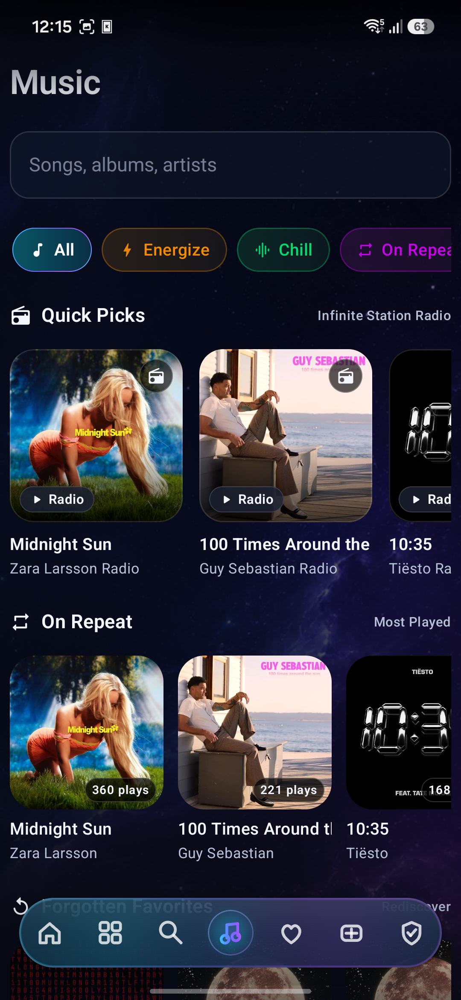
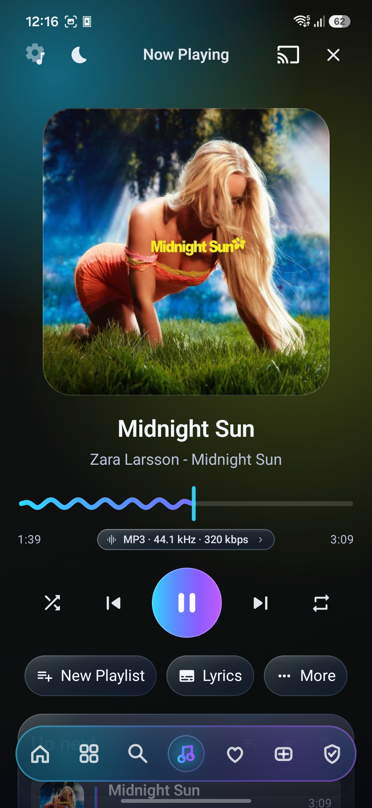
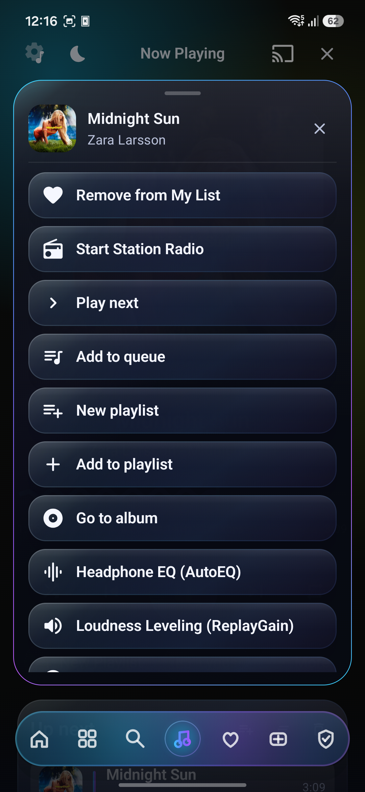
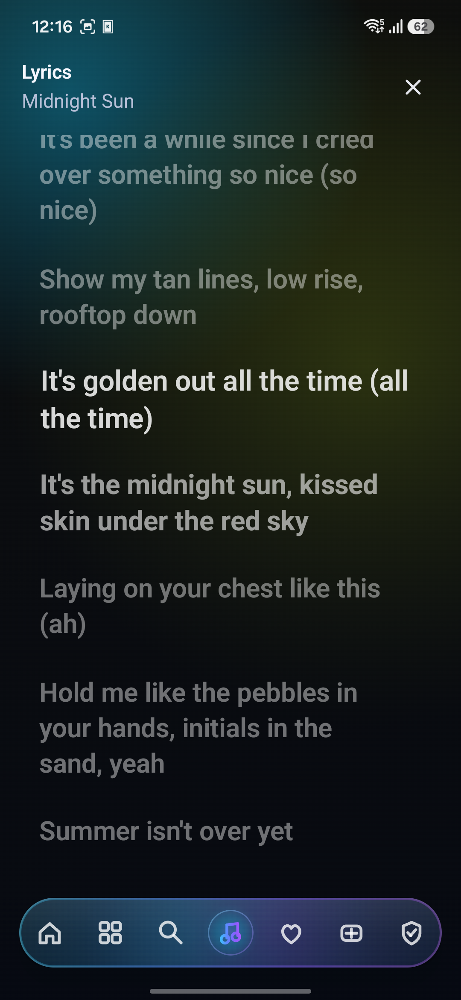
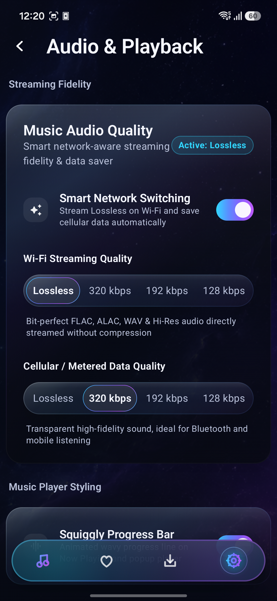
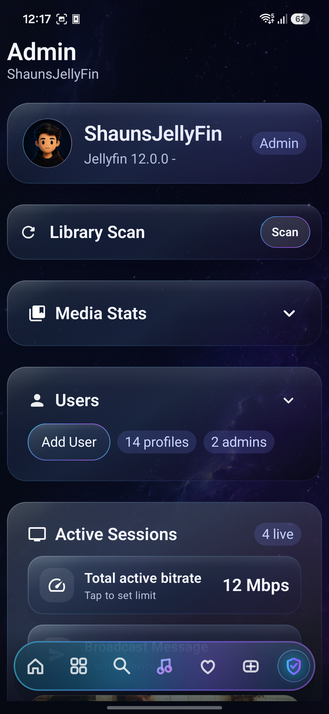

<p align="center">
  
</p>

<h1 align="center">Vantafyn</h1>

<p align="center">
  <strong>The Next Evolution of <a href="https://jellyfin.org">Jellyfin</a> on Android.</strong><br>
  A fluid, cinema-grade client built with Jetpack Compose, AndroidX Media3, Audiophile AutoEQ DSP, gamified achievements, and native social messaging.
</p>

<p align="center">
  <a href="https://github.com/glowseedstudio/Vantafyn/releases/tag/v0.9.9"></a>
  <a href="https://jellyfin.org"></a>
  <a href="https://glowseedstudio.github.io/Vantafyn/"></a>
  <a href="https://developer.android.com/jetpack/compose"></a>
  <a href="https://developer.android.com/guide/topics/media/media3"></a>
  <a href="LICENSE"></a>
</p>

<p align="center">
  <a href="https://github.com/glowseedstudio/Vantafyn/releases/tag/v0.9.9"><strong>⬇️ Download Latest APK (v0.9.9)</strong></a> &nbsp;•&nbsp;
  <a href="https://glowseedstudio.github.io/Vantafyn/"><strong>🌐 Interactive Website & Gallery</strong></a> &nbsp;•&nbsp;
  <a href="#-quick-start"><strong>🚀 Quick Start</strong></a> &nbsp;•&nbsp;
  <a href="docs/ARCHITECTURE.md"><strong>📖 Architecture Docs</strong></a>
</p>

---

> [!TIP]
> **🚀 Jellyfin 12 Support is Here!**
> Vantafyn is fully optimized for **Jellyfin 12** and **10.10+**. Take advantage of Jellyfin 12's new BoxSet collection linking on Mobile and Android TV ("Part of Collection" shelves), updated native Base64 user avatar management, and high-density 3-column library browsing with 100 items per page!

---

## ✨ Why Vantafyn?

Vantafyn is crafted from the ground up to make your self-hosted Jellyfin server feel indistinguishable from a top-tier streaming service—pairing calm obsidian glassmorphism with high-performance audio/video engines.

<table>
  <tr>
    <td width="50%" valign="top">
      <h3>🎬 Cinema Video & Living Room</h3>
      <ul>
        <li><strong>Jellyfin 12 Collection Linking</strong>: Dedicated "Part of Collection" shelf on Mobile and Android TV detail screens with 1-tap franchise browsing.</li>
        <li><strong>High-Performance Streaming</strong>: Built on AndroidX Media3 & ExoPlayer with automatic resume points.</li>
        <li><strong>4K HDR & Dolby Vision</strong>: Streamlined hardware-accelerated video pipelines.</li>
        <li><strong>Playback Enhancements</strong>: Multi-track audio/subtitle switching, zoom/stretch aspect ratios, Up Next countdowns, and Intro/Credit skipping.</li>
        <li><strong>Living Room TV Pairing & Remote Input</strong>: Instant 6-digit TV code pairing and ECDH + AES-256-GCM encrypted "Send Text to TV" keyboard handoff.</li>
        <li><strong>Google Cast & PiP</strong>: Native Cast sender integration and Picture-in-Picture support.</li>
      </ul>
    </td>
    <td width="50%" valign="top">
      <h3>🎵 Audiophile DSP, Music & Harmonia</h3>
      <ul>
        <li><strong>Harmonia Music Recaps</strong>: Spotify Wrapped-caliber animated musical stories, spinning 3D vinyl, listening archetypes, sound palettes, and localized date stats.</li>
        <li><strong>6,000+ Headphone Calibrations</strong>: Full integration of the <a href="https://github.com/jaakkopasanen/AutoEq">AutoEq</a> database (oratory1990, crinacle, Rtings) via hardware equalizer effects.</li>
        <li><strong>ReplayGain & Dynamic Radio</strong>: Real-time PCM loudness normalization with anti-clipping pre-amp and infinite station radio.</li>
        <li><strong>Synced Lyrics & Sleep Timer</strong>: Live karaoke lyrics and customizable fade-out sleep timers with end-of-track options.</li>
        <li><strong>Smart Pre-Caching & OpenSubsonic</strong>: Zero-stutter queue pre-buffering, plus native OpenSubsonic/Navidrome backend support.</li>
        <li><strong>Animated Squiggly Wave</strong>: Dynamic sine wave scrubber that dances during playback and flattens when paused.</li>
      </ul>
    </td>
  </tr>
  <tr>
    <td width="50%" valign="top">
      <h3>🏆 Gamified Achievements & Social</h3>
      <ul>
        <li><strong>Milestone Badges & Rank Tiers</strong>: Progress from Bronze to Mythic with unlocked celebrations and rarity tiers.</li>
        <li><strong>Animated Chromatic Modals</strong>: Signature glowing gradient borders on unlock sheets and inspections.</li>
        <li><strong>1-to-1 Direct Messaging & Reactions</strong>: Real-time chat with delivery receipts, typing sounds, and touch-and-hold emoji reactions.</li>
        <li><strong>Media Sharing & Live Presence</strong>: Share movies directly in chat with "Watch Now" action buttons, and see what server friends are watching in real time.</li>
        <li><strong>Watch Party & SyncPlay</strong>: SyncPlay group sessions with interactive "Swipe to Match" voting to pick what to watch together.</li>
      </ul>
    </td>
    <td width="50%" valign="top">
      <h3>🚗 In-Car Dashboard & True Offline</h3>
      <ul>
        <li><strong>Widescreen Automotive & Android Auto</strong>: Touch-optimized head-unit interface for cars, Android Automotive OS, and official Android Auto media browsing.</li>
        <li><strong>Durable Background Downloads</strong>: WorkManager downloads with offline database for video, music, lyrics, and artwork with auto-reconciliation.</li>
        <li><strong>Live Server Admin & Stats</strong>: Trigger library scans, monitor active sessions/transcodes, manage users/plugins, and inspect viewing trends.</li>
        <li><strong>Dynamic Customization & 6 Themes</strong>: Reorder home rows with live preview, customize card sizing, switch between 6 reactive themes (Nebula, Midnight, Aurora, Amethyst, Ember, OLED), and glide across a magnetic glass dock.</li>
      </ul>
    </td>
  </tr>
</table>

---

## 📸 Interface Showcase

<p align="center">
  <a href="https://glowseedstudio.github.io/Vantafyn/">
    
    
    
    
  </a>
  <br><br>
  <a href="https://glowseedstudio.github.io/Vantafyn/">
    
    
    
    
  </a>
  <br><br>
  <em>Explore all 21 full-resolution screens and interactive lightboxes on the <strong><a href="https://glowseedstudio.github.io/Vantafyn/#gallery">Interactive Web Gallery →</a></strong></em>
</p>

---

## 🔌 Recommended Server Plugins

While Vantafyn works seamlessly out-of-the-box with any standard Jellyfin server, installing these optional server plugins unlocks rich gamification, analytics, and automation:

| Plugin | What It Unlocks | Source |
| :--- | :--- | :---: |
| **Achievement Badges** | Milestone badges, rank tiers, server member friends list, and 1-to-1 direct messaging | [GitHub](https://github.com/ZL154/AchievementBadges_for_Jellyfin) |
| **Playback Reporting** | Server analytics, watch time breakdowns, and Most Watched media trends in Admin | [GitHub](https://github.com/jellyfin/jellyfin-plugin-playbackreporting) |
| **Intro Skipper** | Automatic audio fingerprint analysis to show seamless "Skip Intro" & "Skip Credits" buttons | [GitHub](https://github.com/Intro-Skipper/intro-skipper) |

---

## 🚀 Quick Start

### Direct Download
Production minified APKs are available on the **[Releases Page](https://github.com/glowseedstudio/Vantafyn/releases/tag/v0.9.9)**:
- **Phone / Tablet / Auto**: [`app-mobile-release.apk`](https://github.com/glowseedstudio/Vantafyn/releases/download/v0.9.9/app-mobile-release.apk) *(51 MB, R8-shrunk)*
- **Android TV**: [`app-tv-release.apk`](https://github.com/glowseedstudio/Vantafyn/releases/download/v0.9.9/app-tv-release.apk) *(15 MB)*

### Building from Source

```bash
# Clone the repository
git clone https://github.com/glowseedstudio/Vantafyn.git
cd Vantafyn

# Build Release or Debug APKs
./gradlew :app-mobile:assembleRelease :app-tv:assembleRelease

# Install directly to connected device
adb install -r app-mobile/build/outputs/apk/release/app-mobile-release.apk
```

---

## 📖 Architectural Documentation

Vantafyn features a clean, modular multi-module architecture. Detailed specifications and design documentation are available in the [`docs/`](docs/) directory:

- [Architecture Overview](docs/ARCHITECTURE.md) • [Design System & Materials](docs/DESIGN_SYSTEM.md)
- [Video Playback Pipeline](docs/PLAYBACK_IMPLEMENTATION.md) • [Music & Audio Stack](docs/MUSIC_IMPLEMENTATION.md)
- [Offline Downloads & Sync Engine](docs/OFFLINE_ARCHITECTURE.md) • [Server Admin Features](docs/ADMIN_FEATURES.md)

---

## 💖 Acknowledgements & Community

Vantafyn is built with love as a passion project for the Jellyfin community. Special thanks to:
- **[ZL154](https://github.com/ZL154)** — For the outstanding [Achievement Badges for Jellyfin](https://github.com/ZL154/AchievementBadges_for_Jellyfin) plugin that powers Vantafyn's gamification and social foundations.
- **[Jaakko Pasanen](https://github.com/jaakkopasanen)** — For the open-source [AutoEq](https://github.com/jaakkopasanen/AutoEq) project and dataset contributors (**oratory1990**, **crinacle**, **Rtings**, **Innerfidelity**).
- **[The Jellyfin Team](https://jellyfin.org)** — For building the premier free and open-source media system.
- **The AndroidX & Media3 Team** — For the rock-solid ExoPlayer foundations.

---

## ⚖️ License

This project is licensed under the [GNU General Public License v3.0](LICENSE).
AutoEQ profiles and dataset integration are licensed under the [MIT License](https://github.com/jaakkopasanen/AutoEq/blob/master/LICENSE) courtesy of Jaakko Pasanen.
