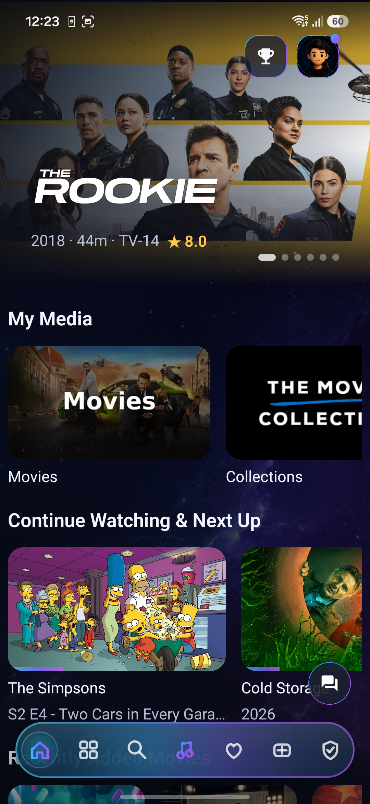
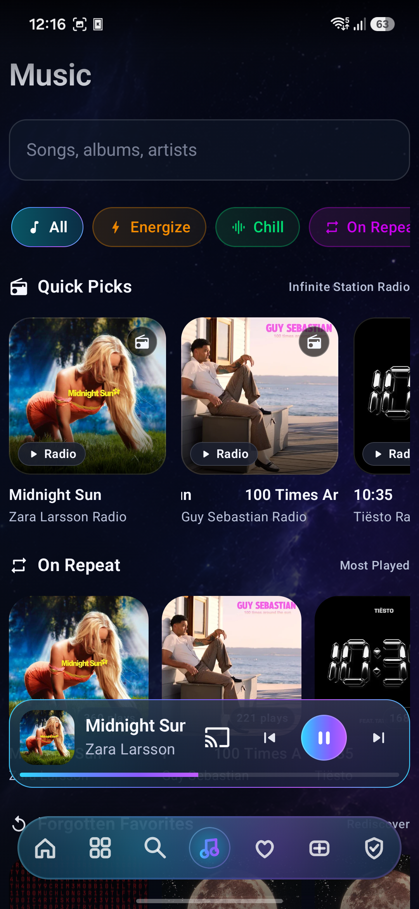
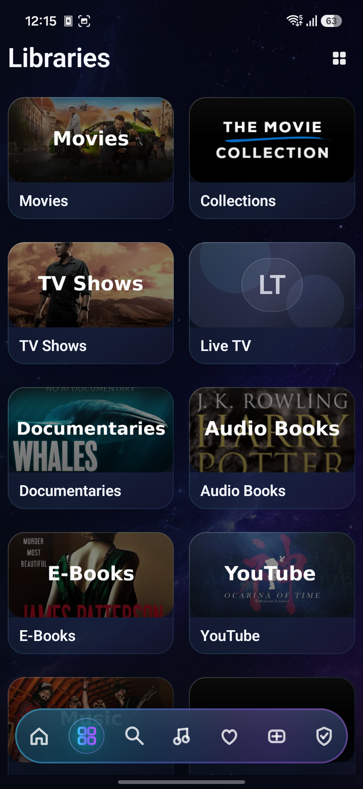
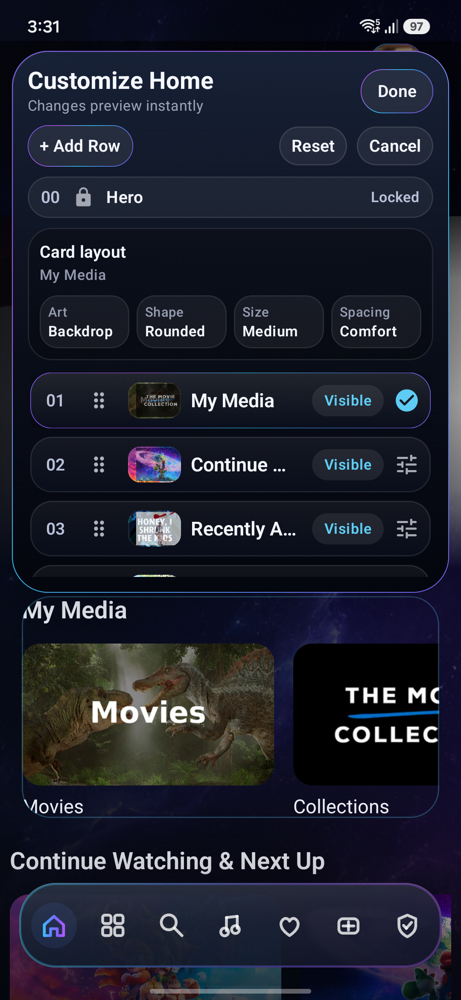
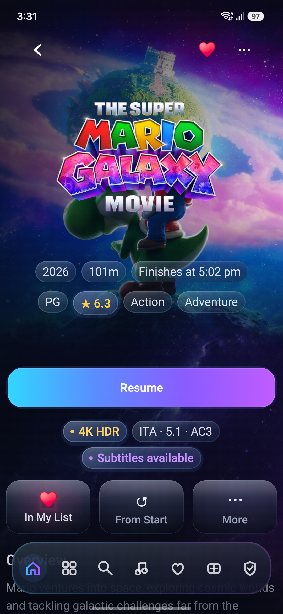
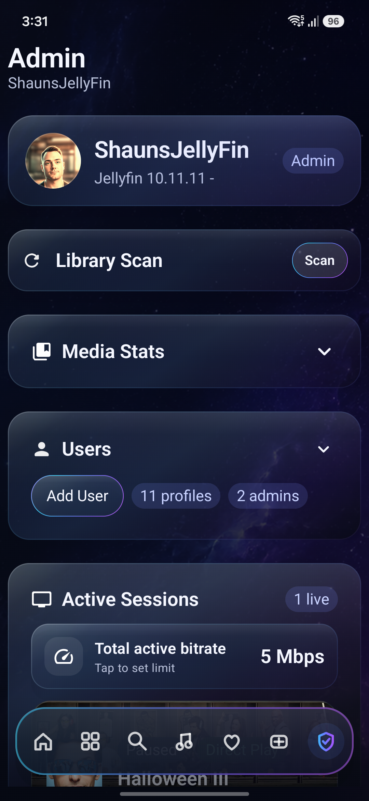
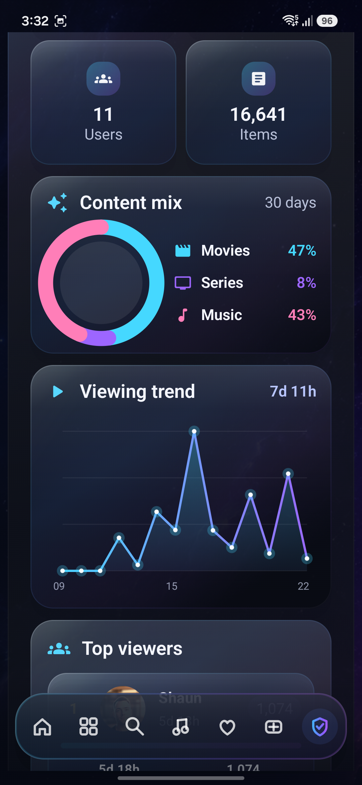
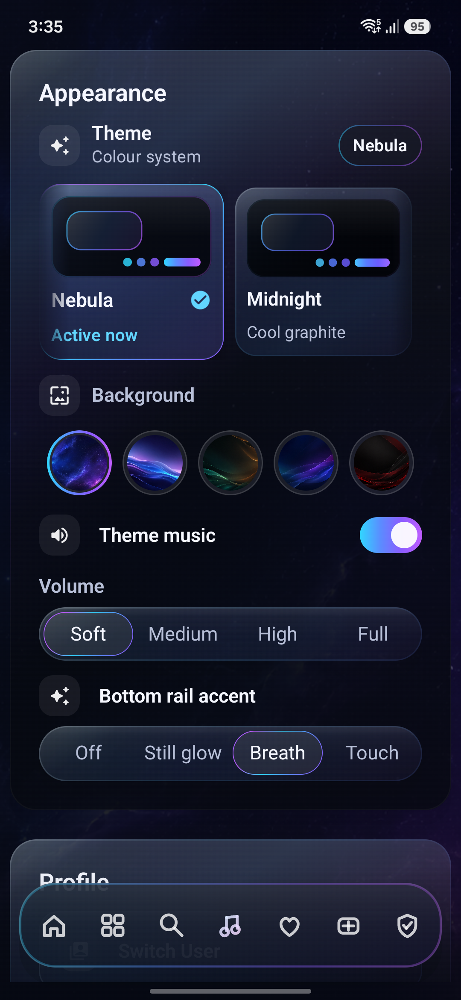

<p align="center">
  
</p>

<h1 align="center">Vantafyn</h1>

<p align="center">
  <strong>A premium, fluid Android & Android TV client for <a href="https://jellyfin.org">Jellyfin</a>.</strong><br>
  Built with Jetpack Compose, AndroidX Media3, dynamic glassmorphism, and offline-first capabilities.
</p>

<p align="center">
  <a href="LICENSE"></a>
  <a href="https://kotlinlang.org/"></a>
  <a href="https://developer.android.com/jetpack/compose"></a>
  <a href="https://developer.android.com/guide/topics/media/media3"></a>
  <a href="https://jellyfin.org/"></a>
  
</p>

---

## 🎬 Preview in Action

<div align="center">
  <video src="https://github.com/glowseedstudio/Vantafyn/raw/main/assets/vantafyn_demo.mp4" width="100%" controls autoplay loop muted></video>
  <p><em>(If the video does not play in your browser, <a href="assets/vantafyn_demo.mp4">click here to download or view the demo video</a>.)</em></p>
</div>

---

## 📖 About The Project

**Vantafyn** was born out of a desire to make a personal Jellyfin server feel indistinguishable from a top-tier streaming platform: calm visual design, rich backdrop artwork, ultra-smooth motion, real-time server synchronisation, rock-solid video/audio playback, true offline downloads, and advanced administration tools.

I am a solo developer working on Vantafyn in my spare time as a passion project. What began strictly as a personal media client has matured into an expansive, modular suite that is now proud to be open-sourced to the Jellyfin and Android communities.

---

## 🤖 AI Assistance Disclosure

**Vantafyn is an AI-assisted software project.**

I want to be completely transparent about that. I have been developing software for around six years, and rather than building every part of Vantafyn entirely by hand and burning myself out, I use AI coding tools as part of my development workflow.

AI is primarily used to accelerate tasks such as:
- Initial scaffolding and boilerplate
- Basic feature implementation
- Repetitive development work
- Exploring possible solutions

**This does not mean Vantafyn is blindly generated or "vibe coded."**

I review all code that goes into the project, understand how it works, debug issues myself, manually optimise and refactor where necessary, and make all of the architectural, technical, UI, and product decisions behind the application.

> **AI is an assistant, not the developer.**

Used properly, I believe AI can be an extremely powerful development tool. The important part is having a strong understanding of the system you are building, knowing what you are asking the tool to do, and being capable of reviewing, correcting, and improving what it produces.

Simply accepting generated code without understanding or validating it can lead to poor architecture, bugs, security problems, and difficult-to-maintain software. That is not how Vantafyn is developed.

Ultimately, I am responsible for the code that ships.

I also understand that some people prefer not to use software developed with AI assistance, and that is completely their choice. I would rather be open about my development process than hide it.

*Vantafyn is AI assisted, human directed, human reviewed, and human maintained.*

---

## 📸 Screenshots & UI Showcase

<table align="center">
  <tr>
    <td align="center" width="25%">
      <br>
      <strong>Home & Discovery</strong><br>
      <em>Hero backdrop carousel, Continue Watching, and glass bottom navigation.</em>
    </td>
    <td align="center" width="25%">
      <br>
      <strong>Persistent Music Player</strong><br>
      <em>Seamless floating mini-player with Media3 foreground service controls.</em>
    </td>
    <td align="center" width="25%">
      <br>
      <strong>Media Libraries</strong><br>
      <em>Grid and list views for Movies, TV, Live TV, Music, Audiobooks & E-Books.</em>
    </td>
    <td align="center" width="25%">
      <br>
      <strong>Live Home Customizer</strong><br>
      <em>Reorder rows, toggle visibility, and tweak card sizing with live previews.</em>
    </td>
  </tr>
  <tr>
    <td align="center" width="25%">
      <br>
      <strong>Media Details</strong><br>
      <em>4K/HDR stream badges, audio/subtitle selectors, and quick resume.</em>
    </td>
    <td align="center" width="25%">
      <br>
      <strong>Server Administration</strong><br>
      <em>Trigger library scans, manage user accounts, and track live bandwidth.</em>
    </td>
    <td align="center" width="25%">
      <br>
      <strong>Analytics & Trends</strong><br>
      <em>Interactive content breakdown charts and 30-day viewing trend graphs.</em>
    </td>
    <td align="center" width="25%">
      <br>
      <strong>Themes & Accents</strong><br>
      <em>Nebula/Midnight color systems, dynamic wallpapers, and breathing rail glows.</em>
    </td>
  </tr>
</table>

---

## ✨ Key Capabilities

- 🎬 **High-Performance Video Playback**: Media3 ExoPlayer engine with Jellyfin playback reporting, resume points, multi-track audio and subtitle selection, zoom/stretch aspect ratios, Up Next countdowns, skip intro/segments, and Google Cast support.
- 🎵 **Dedicated Foreground Music Service**: Media3-backed background playback with lock screen controls, notification actions, Android Auto library browsing, playlists, queues, synchronized lyrics, and offline music caching.
- 📦 **Offline Downloads Engine**: WorkManager-orchestrated background downloads with local database caching, full offline playback, and automatic playback-state reconciliation once reconnected.
- 📥 **Media Requests (Ombi & Seerr)**: Native requests workflow supporting shared API keys and per-user token linking. While Ombi is currently undergoing testing alongside the companion plugin, support for *Seerr* services (Jellyseerr / Overseerr) is on the roadmap so you can use either backend.
- 🛡️ **Built-in Server Admin Suite**: View active server sessions, inspect live stream bitrates, manage server profiles, trigger library scans, inspect tasks, and visualize Playback Reporting statistics.
- 🎨 **Deep Customization & Theming**: Live customizable home screen rows, glassmorphic surface materials, dynamic space backgrounds, theme music, and interactive glow feedback.
- 🍿 **Social & Discovery**: Group Watch Party / SyncPlay foundations, app-wide invitations, and Swipe to Match movie decision picker.

---

## 🚦 Current Status & Roadmap

| Platform / Module | Status | Description |
| :--- | :---: | :--- |
| **Android Phone App** | 🟢 **~92% Complete** | Core UI, playback, offline downloads, music player, and server features are fully functional and daily-driver ready. |
| **Android TV App** | 🟡 **In Development** | TV architecture and module build correctly. Dedicated 10-foot TV UI is being built using the proven mobile architecture foundations. |
| **Companion Server Plugin** | 🟡 **In Development** | The `companion-plugin` for Jellyfin is currently being built to provide enhanced multi-user sync and deeper Ombi integration. |
| **Requests (Ombi & Seerr)** | 🟢 **Testing / Planned** | Ombi is implemented and actively being tested in tandem with the companion plugin. Support for Seerr services (Jellyseerr / Overseerr) is on the roadmap so either service can be used. |

---

## 🛠️ Project Architecture

```
├── app-mobile/          # Android phone entry point, manifest, navigation graph & DI wiring
├── app-tv/              # Android TV entry point (leanback/TV UI foundations)
├── core-cast/           # Google Cast sender integration
├── core-downloads/      # Durable offline downloads & sync reconciliation
├── core-integrations/   # Encrypted token storage & third-party integrations
├── core-jellyfin/       # Jellyfin SDK integration, authentication & repositories
├── core-media/          # Media3 playback service, audio session & Android Auto
├── core-ombi/           # Ombi API client & request handling
├── core-ui/             # Vantafyn glass design system, animations & UI primitives
├── feature-home/        # Home screen, discovery, details, search & admin tools
├── feature-music/       # Dedicated music player, lyrics viewer & queue management
├── feature-player/      # Video player UI, gestures & track controls
├── feature-requests/    # Ombi Requests discovery & submission flows
├── companion-plugin/    # C# Jellyfin Server companion plugin
└── docs/                # Architectural diagrams & specifications
```

---

## 🔨 Building and Running

### Requirements
- **JDK 17** or newer
- **Android SDK** (API 34+)
- **Android Studio** Ladybug / Meerkat (or CLI Gradle)

### Build Debug APKs

```bash
# Build Mobile & TV debug binaries
./gradlew :app-mobile:assembleDebug :app-tv:assembleDebug
```

### Install to Device

```bash
# Install to connected phone
adb install -r app-mobile/build/outputs/apk/debug/app-mobile-debug.apk

# Install to Android TV
adb install -r app-tv/build/outputs/apk/debug/app-tv-debug.apk
```

---

## 📄 Documentation

- [Architecture Overview](docs/ARCHITECTURE.md)
- [Design System & Materials](docs/DESIGN_SYSTEM.md)
- [Video Playback Implementation](docs/PLAYBACK_IMPLEMENTATION.md)
- [Music Stack Implementation](docs/MUSIC_IMPLEMENTATION.md)
- [Offline & Downloads Architecture](docs/OFFLINE_ARCHITECTURE.md)
- [Ombi Requests Integration](docs/ombi-requests-implementation.md)
- [Admin Features](docs/ADMIN_FEATURES.md)
- [Permissions Guide](docs/PERMISSIONS.md)

---

## ⚖️ License

This project is open-source software licensed under the [GNU General Public License v3.0](LICENSE).

