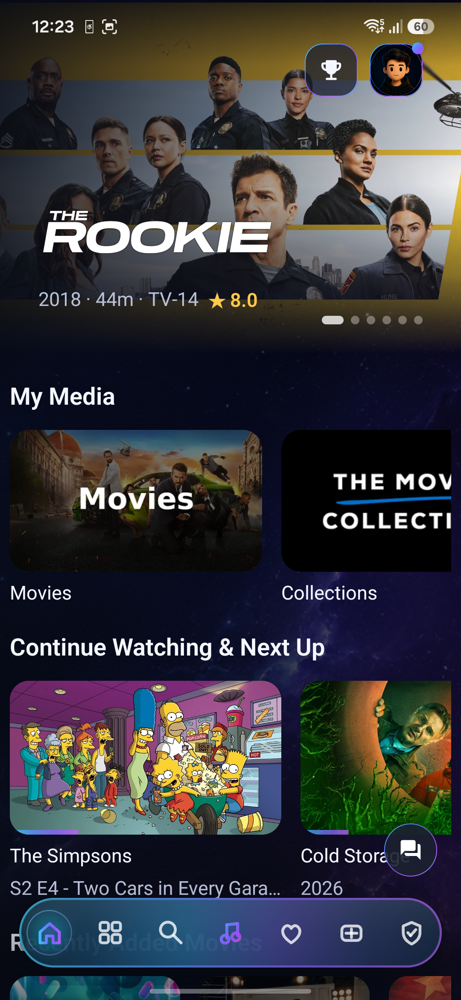
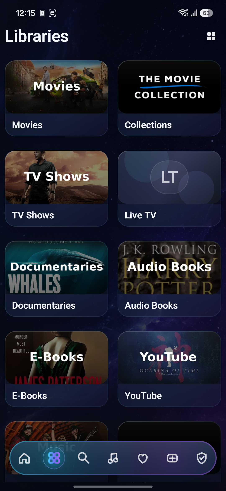
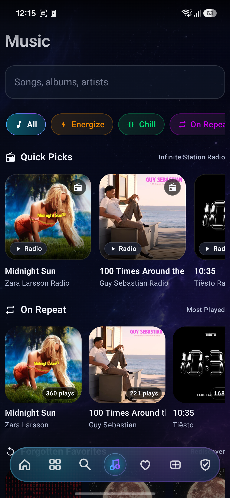
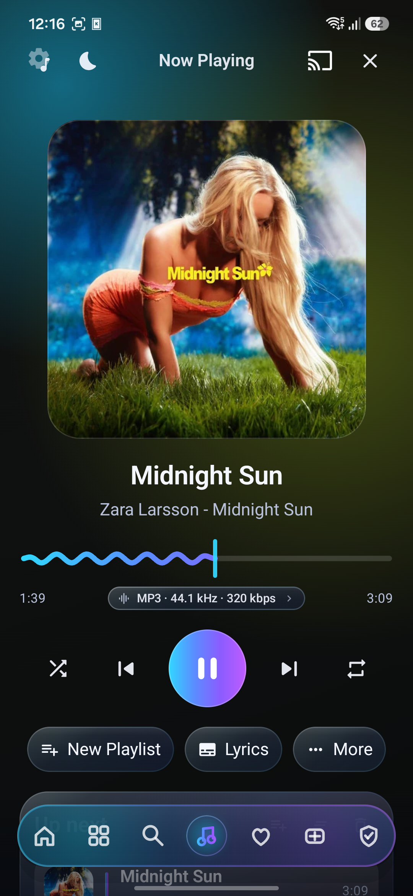
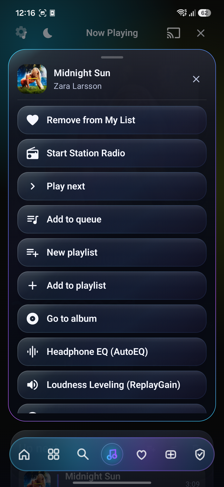
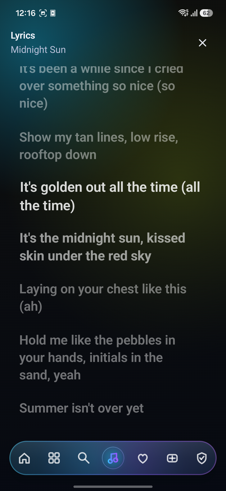
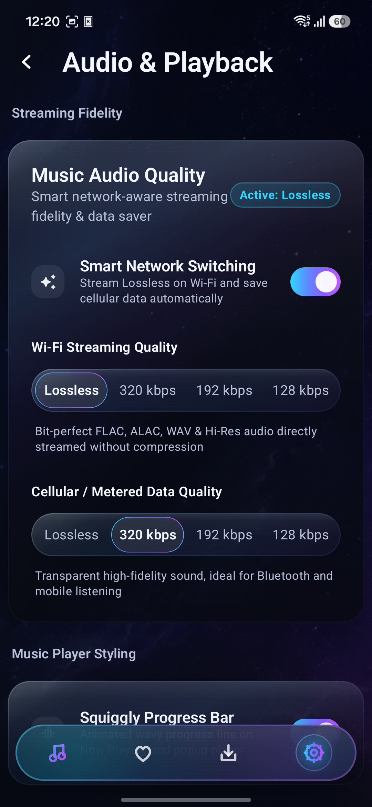
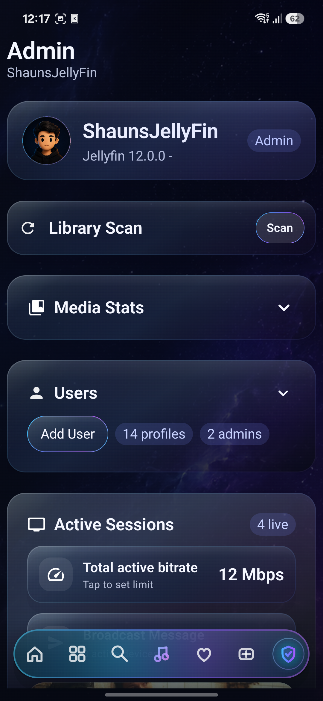

<p align="center">
  
</p>

<h1 align="center">Vantafyn</h1>

<p align="center">
  <strong>The Next Evolution of <a href="https://jellyfin.org">Jellyfin</a> on Android.</strong><br>
  A fluid, cinema-grade client built with Jetpack Compose, AndroidX Media3, Audiophile AutoEQ DSP, Libretro retro gaming with cloud saves, a cross-generation Pokémon Vault, and native social messaging.
</p>

<p align="center">
  <a href="https://github.com/glowseedstudio/Vantafyn/releases/tag/v0.9.61"></a>
  <a href="https://jellyfin.org"></a>
  <a href="https://glowseedstudio.github.io/Vantafyn/"></a>
  <a href="https://developer.android.com/jetpack/compose"></a>
  <a href="https://developer.android.com/guide/topics/media/media3"></a>
  <a href="#-libretro-retro-gaming-hub--cloud-saves"></a>
  <a href="#-pokémon-cloud-vault--pkvault-server-integration"></a>
  <a href="#-unifiedpush--ntfy-real-time-notifications"></a>
  <a href="LICENSE"></a>
</p>

<p align="center">
  <a href="https://github.com/glowseedstudio/Vantafyn/releases/tag/v0.9.61"><strong>⬇️ Download Latest APK (v0.9.61)</strong></a> &nbsp;•&nbsp;
  <a href="https://glowseedstudio.github.io/Vantafyn/"><strong>🌐 Interactive Website & Gallery</strong></a> &nbsp;•&nbsp;
  <a href="#-quick-start"><strong>🚀 Quick Start</strong></a> &nbsp;•&nbsp;
  <a href="docs/ARCHITECTURE.md"><strong>📖 Architecture Docs</strong></a>
</p>

---

> [!TIP]
> **🚀 Jellyfin 12 Support is Here!**
> Vantafyn is fully optimized for **Jellyfin 12** and **10.10+**. Take advantage of Jellyfin 12's new BoxSet collection linking on Mobile and Android TV ("Part of Collection" shelves), updated native Base64 user avatar management, and high-density 3-column library browsing with 100 items per page!

---

## ✨ Why Vantafyn?

Vantafyn is crafted from the ground up to make your self-hosted Jellyfin server feel indistinguishable from a top-tier streaming service—pairing calm obsidian glassmorphism with high-performance audio/video engines.

<table>
  <tr>
    <td width="50%" valign="top">
      <h3>🎬 Cinema Video & Living Room</h3>
      <ul>
        <li><strong>Jellyfin 12 Collection Linking</strong>: Dedicated "Part of Collection" shelf on Mobile and Android TV detail screens with 1-tap franchise browsing.</li>
        <li><strong>High-Performance Streaming</strong>: Built on AndroidX Media3 & ExoPlayer with automatic resume points.</li>
        <li><strong>4K HDR & Dolby Vision</strong>: Streamlined hardware-accelerated video pipelines.</li>
        <li><strong>Playback Enhancements</strong>: Multi-track audio/subtitle switching, zoom/stretch aspect ratios, Up Next countdowns, and Intro/Credit skipping.</li>
        <li><strong>Living Room TV Pairing & Remote Input</strong>: Instant 6-digit TV code pairing and ECDH + AES-256-GCM encrypted "Send Text to TV" keyboard handoff.</li>
        <li><strong>Google Cast & PiP</strong>: Native Cast sender integration and Picture-in-Picture support.</li>
      </ul>
    </td>
    <td width="50%" valign="top">
      <h3>🎵 Audiophile DSP, Music & Harmonia</h3>
      <ul>
        <li><strong>Harmonia Music Recaps</strong>: Spotify Wrapped-caliber animated musical stories, spinning 3D vinyl, listening archetypes, sound palettes, and localized date stats.</li>
        <li><strong>6,000+ Headphone Calibrations</strong>: Full integration of the <a href="https://github.com/jaakkopasanen/AutoEq">AutoEq</a> database (oratory1990, crinacle, Rtings) via hardware equalizer effects.</li>
        <li><strong>ReplayGain & Dynamic Radio</strong>: Real-time PCM loudness normalization with anti-clipping pre-amp and infinite station radio.</li>
        <li><strong>Synced Lyrics & Sleep Timer</strong>: Live karaoke lyrics and customizable fade-out sleep timers with end-of-track options.</li>
        <li><strong>Smart Pre-Caching & OpenSubsonic</strong>: Zero-stutter queue pre-buffering, plus native OpenSubsonic/Navidrome backend support.</li>
        <li><strong>Animated Squiggly Wave</strong>: Dynamic sine wave scrubber that dances during playback and flattens when paused.</li>
      </ul>
    </td>
  </tr>
  <tr>
    <td width="50%" valign="top">
      <h3>🏆 Gamified Achievements & Social</h3>
      <ul>
        <li><strong>Milestone Badges & Rank Tiers</strong>: Progress from Bronze to Mythic with unlocked celebrations and rarity tiers.</li>
        <li><strong>Animated Chromatic Modals</strong>: Signature glowing gradient borders on unlock sheets and inspections.</li>
        <li><strong>1-to-1 Direct Messaging & Reactions</strong>: Real-time chat with delivery receipts, typing sounds, and touch-and-hold emoji reactions.</li>
        <li><strong>Media Sharing & Live Presence</strong>: Share movies directly in chat with "Watch Now" action buttons, and see what server friends are watching in real time.</li>
        <li><strong>Watch Party & SyncPlay</strong>: SyncPlay group sessions with interactive "Swipe to Match" voting to pick what to watch together.</li>
      </ul>
    </td>
    <td width="50%" valign="top">
      <h3>🚗 In-Car Dashboard & True Offline</h3>
      <ul>
        <li><strong>Widescreen Automotive & Android Auto</strong>: Touch-optimized head-unit interface for cars, Android Automotive OS, and official Android Auto media browsing.</li>
        <li><strong>Durable Background Downloads</strong>: WorkManager downloads with offline database for video, music, lyrics, and artwork with auto-reconciliation.</li>
        <li><strong>Live Server Admin & Stats</strong>: Trigger library scans, monitor active sessions/transcodes, manage users/plugins, and inspect viewing trends.</li>
        <li><strong>Dynamic Customization & 6 Themes</strong>: Reorder home rows with live preview, customize card sizing, switch between 6 reactive themes (Nebula, Midnight, Aurora, Amethyst, Ember, OLED), and glide across a magnetic glass dock.</li>
      </ul>
    </td>
  </tr>
  <tr>
    <td width="50%" valign="top">
      <h3>🕹️ Libretro Gaming & Cloud Saves</h3>
      <ul>
        <li><strong>Embedded Libretro Cores</strong>: Native emulation for Game Boy, GBC, GBA, Nintendo DS, NES, SNES, N64, PlayStation, Sega Genesis, and Arcade.</li>
        <li><strong>Cross-Device Cloud Saves</strong>: Bi-directional sync for emulator save states (<code>.state</code>) and cartridge battery SRAM (<code>.sram</code> / <code>.sav</code>) backed up to your Jellyfin server via the Companion Plugin.</li>
        <li><strong>Touch Gamepad & Physical Controllers</strong>: Fully customizable on-screen touch controls with haptic feedback, plus plug-and-play auto-mapping for Bluetooth and USB gamepads.</li>
        <li><strong>Atmospheric Game Hub</strong>: Dynamic ambient background music, disc swapping, fast-forwarding, rewind, CRT scanline shaders, and automatic box art scraping.</li>
      </ul>
    </td>
    <td width="50%" valign="top">
      <h3>🔴 Pokémon Cloud Vault & Pokédex</h3>
      <ul>
        <li><strong>30-Box Cloud PC Storage</strong>: Securely store, organize, and inspect up to 900 Pokémon specimens on your self-hosted server backed by <a href="#-pokémon-cloud-vault--pkvault-server-integration">PKVault</a>.</li>
        <li><strong>Native Gen 1–5 Save Parsers</strong>: Natively read and extract caught Pokémon directly from Game Boy, GBA, and NDS save cartridges (<code>.sav</code> / <code>.dsv</code>) without risk of corruption.</li>
        <li><strong>Stat Radar Hexagon & IV Tracker</strong>: Dynamic polygon stat spread showing authentic IV distributions with zero-stat origin alignment, alongside traditional horizontal stat bars.</li>
        <li><strong>Cross-Game Transfers & Safety Backups</strong>: Transfer specimens between cartridge saves or trade with server friends with automated pre-mutation backups protecting original save files.</li>
        <li><strong>Encyclopedic Lore & Audio Cries</strong>: Official species lore entries, metric/imperial physical data, base stats, learnsets, evolution trees, and authentic audio cries with smart music ducking.</li>
      </ul>
    </td>
  </tr>
</table>

---

## 📸 Interface Showcase

<p align="center">
  <a href="https://glowseedstudio.github.io/Vantafyn/">
    
    
    
    
  </a>
  <br><br>
  <a href="https://glowseedstudio.github.io/Vantafyn/">
    
    
    
    
  </a>
  <br><br>
  <em>Explore all 21 full-resolution screens and interactive lightboxes on the <strong><a href="https://glowseedstudio.github.io/Vantafyn/#gallery">Interactive Web Gallery →</a></strong></em>
</p>

---

## 🕹️ Libretro Retro Gaming Hub & Cloud Saves

Vantafyn integrates a full **Libretro retro gaming environment** directly alongside your movies, shows, and music. Turn your Jellyfin server into a personal cloud retro console:

- **Library Auto-Discovery**: Organize your ROM collections in standard Jellyfin media folders. Vantafyn automatically detects game systems and categorizes titles across Nintendo (Game Boy, GBC, GBA, NDS, NES, SNES, N64), Sega (Genesis / Mega Drive), Sony (PlayStation / PSX), Arcade, and more.
- **Embedded Emulation Cores**: Powered by high-performance, embedded Libretro cores. Play instantly with optimized frame pacing, CRT scanline and smoothing video shaders, fast-forward toggles, and rewind controls.
- **Bi-Directional Cloud Saves & SRAM Sync**: Play on your phone during your commute, then pick up right where you left off on your living room Android TV. Emulator save states (`.state`) and cartridge battery SRAM (`.sram` / `.sav`) are automatically synchronized to your Jellyfin server via the [Vantafyn Companion Plugin](#-the-vantafyn-companion-plugin--the-central-ecosystem-bridge).
- **Controls & Gamepad Support**: Intuitive, customizable on-screen touch overlay with tactile haptic feedback, custom button layout sizing, and opacity adjustment. Physical Bluetooth and USB gamepads (Xbox, PlayStation, 8BitDo, etc.) are auto-detected with plug-and-play controller mapping.
- **Atmospheric Hub & Scraper**: Rich game hub experience with ambient background themes, box art scraping, disc-swapping controls for multi-disc titles, and playtime tracking.

---

## 🔴 Pokémon Cloud Vault & PKVault Server Integration

Vantafyn includes a dedicated **Pokémon Vault & Pokédex Hub** designed for classic cartridge generations (Gen 1 through Gen 5):

<table>
  <tr>
    <td width="50%" valign="top">
      <h4>🏛️ 30-Box Cloud PC Storage</h4>
      Store, organize, and inspect up to <strong>900 Pokémon</strong> across 30 cloud boxes hosted on your self-hosted server infrastructure. Sort by generation, typing, shiny status, or IV ranking.
    </td>
    <td width="50%" valign="top">
      <h4>🧬 Native Gen 1–5 Save Extraction</h4>
      Autonomous on-device parsers read and extract caught Pokémon directly from Game Boy, GBA, and Nintendo DS save cartridges (<code>.sav</code> and <code>.dsv</code>) without risk of corruption.
    </td>
  </tr>
  <tr>
    <td width="50%" valign="top">
      <h4>📊 Dynamic Stat Radar Hexagon</h4>
      Interactive polygon stat radar mapping exact IV and EV spreads with true zero-stat origin alignment. Toggle seamlessly between classic horizontal bars and the dynamic hexagon radar view.
    </td>
    <td width="50%" valign="top">
      <h4>🔁 Cross-Game Trading & Safe Transfers</h4>
      Transfer Pokémon between cartridge save files, move specimens up generations, or trade directly with server friends. Automatic pre-mutation safety backups protect your original save files.
    </td>
  </tr>
  <tr>
    <td width="50%" valign="top">
      <h4>📖 Encyclopedic Pokédex & Lore</h4>
      Explore authentic lore entries, species classification, metric & imperial specifications, base stat spreads, move learnsets, evolution trees, and battle archetype tags.
    </td>
    <td width="50%" valign="top">
      <h4>🔊 Authentic Cries & Music Ducking</h4>
      Listen to official species sound cries streamed on demand. Ambient background music automatically ducks down to 20% so cries ring through clearly.
    </td>
  </tr>
</table>

### Why PKVault is Required as a Server Backend

> [!IMPORTANT]
> **Understanding the PKVault Requirement**
> 
> While Vantafyn includes autonomous on-device parsers capable of reading and inspecting local cartridge save files, **full cloud-box storage (900 Pokémon), legality verification, cross-generation evolution and migration (e.g., Gen 3 → Gen 4/5), and multi-user cross-cartridge trading require [PKVault](https://github.com/glowseedstudio/PKVault) running as a backend service.**
>
> PKVault acts as the dedicated Pokémon logic engine and database. It handles Pokémon byte-structure translations, legality validation, and atomic box transactions.

### How the Architecture Connects Together

The Vantafyn ecosystem is designed with strict security, local-network boundaries, and zero client exposure:

```
┌─────────────────────────────────┐
│     Vantafyn Client App         │  (Phone / Tablet / Android TV)
│  (UI, Local Parsers, Game Hub)  │
└────────────────┬────────────────┘
                 │  Jellyfin API / Token Auth
                 ▼
┌─────────────────────────────────┐
│    Jellyfin Media Server        │
│  ┌───────────────────────────┐  │
│  │ Vantafyn Companion Plugin │  │  (Central Nervous System & Gateway)
│  └─────────────┬─────────────┘  │
└────────────────┼────────────────┘
                 │  Internal / Docker Network Only (e.g., http://pkvault:5000)
                 ▼
┌─────────────────────────────────┐
│         PKVault Server          │  (Cloud Boxes, Legality, Conversion)
└─────────────────────────────────┘
```

1. **Client Isolation**: The Vantafyn mobile and TV clients **never connect directly to PKVault**. All communication is authenticated through your Jellyfin user session and proxied securely by the **Vantafyn Companion Plugin**.
2. **Zero Corruption Guarantee**: Before any Pokémon transfer, migration, or trade writes data into a cartridge save file, the Companion Plugin creates an immutable, timestamped `.bak` backup copy on the server.
3. **Private Network Friendly**: PKVault can run entirely inside an internal Docker network alongside Jellyfin without exposing any ports to the outside world.

### Complete Self-Hosted Ecosystem (Docker Compose)

You can run Jellyfin, PKVault, and ntfy together seamlessly in your server's `docker-compose.yml`:

```yaml
services:
  jellyfin:
    image: jellyfin/jellyfin:latest
    container_name: jellyfin
    restart: unless-stopped
    volumes:
      - /opt/jellyfin/config:/config
      - /opt/jellyfin/cache:/cache
      - /media:/media
    ports:
      - "8096:8096"
    networks:
      - internal-net

  pkvault:
    image: ghcr.io/glowseedstudio/pkvault:latest
    container_name: pkvault
    restart: unless-stopped
    environment:
      - PORT=5000
    volumes:
      - /opt/pkvault/data:/app/data
    networks:
      - internal-net

  ntfy:
    image: binwiederhier/ntfy:latest
    container_name: ntfy
    restart: unless-stopped
    command: serve
    environment:
      - NTFY_BASE_URL=https://ntfy.yourdomain.com  # or http://your-server-ip:8080
      - NTFY_BEHIND_PROXY=true
    volumes:
      - /opt/ntfy/cache:/var/cache/ntfy
      - /opt/ntfy/etc:/etc/ntfy
    ports:
      - "8080:80"
    networks:
      - internal-net

networks:
  internal-net:
    driver: bridge
```

Once running, configure the Companion Plugin in Jellyfin:
1. Open the Jellyfin Web Admin: **Dashboard** ➔ **Plugins** ➔ **Vantafyn Companion**.
2. Scroll to **Pokémon Configuration**:
   - Check **Enable Pokémon Vault Integration**.
   - Set **PKVault Base URL**: `http://pkvault:5000` (or `http://localhost:5000` if on host network).
   - Configure allowed features: **Allow Transfers**, **Allow Cross-Generation Transfers**, and **Allow Trading**.
   - *(Optional)* Set **Custom Background Image** path or URL for Pokémon Vault & modal backdrops.
   - *(Optional)* Set a custom directory for offline/local Pokémon cries.
3. Click **Save Configuration**.

---

### 🛡️ Pokémon / PK Vault — Scope & Disclaimer

Vantafyn and PK Vault are independent, unofficial projects created for retro game preservation, personal save-file management, and use with games that users legally provide themselves.

#### What PK Vault does

PK Vault is designed exclusively to work with user-provided retro emulator save files, currently covering supported Pokémon games from the Game Boy, Game Boy Color, Game Boy Advance, and Nintendo DS generations.

Its features are intended to let users:

- Read and manage their own emulator save files.
- Back up and restore those saves.
- View Pokédex, trainer, badge, Pokémon, and related save data.
- Transfer compatible Pokémon between supported retro emulator save files.
- Restore or enable event flags contained within supported legacy save formats.
- Preserve Pokémon and progress across the user's own emulated games.

PK Vault operates as a self-hosted retro save-management system. It is not intended to interact with Nintendo's current Pokémon ecosystem.

#### What PK Vault does NOT do

PK Vault does not:

- Connect to or modify Pokémon HOME.
- Connect to Nintendo Account or Nintendo Switch Online services.
- Modify Nintendo Switch Pokémon games or their save data.
- Provide a pathway for modified Pokémon or emulator save data into current official Pokémon games or services.
- Provide Nintendo Switch emulation or Switch circumvention functionality.
- Supply Pokémon game ROMs, firmware, encryption keys, BIOS files, or other copyrighted game files.
- Circumvent Nintendo's current online services, authentication systems, DRM, or other technological protection measures.

Users are responsible for supplying and managing their own legally obtained game and save data.

> **Later-generation save import**: PK Vault may read user-provided save files from supported later-generation games, including Nintendo 3DS and Nintendo Switch titles, solely for importing Pokémon and Pokédex information into the user's self-hosted PK Vault. These imports are read-only and come from emulators. PK Vault does not modify, patch, write back to, or export Pokémon into those save files, and imported data cannot be transferred from PK Vault into Nintendo's current games, hardware, Pokémon HOME, accounts, or online services.

#### Assets and third-party data

Vantafyn does not bundle Pokémon game ROMs with the application. Where supported, metadata and other externally sourced resources may be retrieved at runtime from third-party services and remain subject to their respective licences, terms, and intellectual-property rights.

#### Unofficial project

Vantafyn and PK Vault are unofficial, fan-made projects.

They are not affiliated with, authorised by, endorsed by, sponsored by, or associated with Nintendo, The Pokémon Company, Game Freak, Creatures Inc., or their affiliates.

Pokémon, Pokémon character names, Nintendo, Nintendo Switch, Pokémon HOME, and related names, characters, artwork, trademarks, and intellectual property are the property of their respective owners.

The purpose of PK Vault is limited to personal management and preservation of user-provided retro emulator save data. It is deliberately designed without integration into Nintendo's current Pokémon games, hardware, accounts, or online services.

---

## 🔌 The Vantafyn Companion Plugin: The Central Ecosystem Bridge

Standard Jellyfin servers are built purely for video and music streaming. To power an all-in-one entertainment OS with retro gaming, cloud saves, Pokémon storage, synchronized settings, and private push notifications, Vantafyn utilizes the **Vantafyn Companion Plugin** as its central server-side bridge.

The Companion Plugin runs natively inside Jellyfin (supporting both **Jellyfin 10.11 on .NET 9** and **Jellyfin 12 on .NET 10**) and unlocks:

### 1. Retro ROM Streaming & Cloud Save Synchronization
- **Byte-Range ROM Streaming**: Exposes game library ROM files with HTTP range request support for instant, zero-stutter emulator loading.
- **Cloud Save State & SRAM Backups**: Stores emulator save states (`.state`) and battery SRAM (`.sram` / `.sav`) on the server with user ownership isolation, synchronizing progress across all your Android devices.

### 2. Pokémon Vault Gateway & Cry Audio Service
- **Secure PKVault Proxy**: Connects the app to your internal PKVault server, managing box queries and transaction boundaries.
- **Safety Backups**: Automatically backs up cartridge save files before any Pokémon trade or transfer operation.
- **On-Demand Cry Streaming**: Serves official species audio cries (`/Pokemon/Cries/{id}`) with server-side caching and fallback resolution.
- **Custom Aesthetic Themes**: Enables server admins to serve custom background art to all connected clients.

### 3. UnifiedPush Notification Broker
- Delivers real-time push notifications for 1-to-1 direct messages, friend activity, and server alerts.
- Completely free of Google Play Services or Firebase — works on de-Googled devices (GrapheneOS, CalyxOS, LineageOS) via UnifiedPush.

### 4. Cross-Device Settings & Theme Synchronization
- Automatically keeps your UI preferences in sync across your phone, tablet, and TV:
  - Selected theme (Nebula, Midnight, Aurora, Amethyst, Ember, OLED)
  - AutoEQ headphone calibration presets
  - Custom home screen row ordering and card sizes
  - Media audio/subtitle language preferences

### 5. Watch Parties & SyncPlay Remote Coordination
- Powers real-time SyncPlay sessions with Tinder-style interactive "Swipe to Match" voting for groups trying to decide what to watch together.

### 6. Media Requests (Ombi Integration)
- Search for movies and TV series not yet on your server and submit requests directly within the Vantafyn app through your Ombi instance.

---

## 🔔 UnifiedPush & ntfy: Real-Time Notifications

Traditional Android streaming apps either drain device battery by running aggressive background polling loops or rely on proprietary Google Play Services (Firebase Cloud Messaging / FCM), which compromises user privacy and fails entirely on de-Googled devices.

Vantafyn uses the **[UnifiedPush](https://unifiedpush.org/)** open standard paired with **[ntfy](https://ntfy.sh/)** to deliver instant, battery-friendly push notifications with zero third-party telemetry:

```
┌─────────────────────────────────┐
│     Vantafyn Mobile App         │
└────────────────┬────────────────┘
                 │ 1. Registers with distributor
                 ▼
┌─────────────────────────────────┐
│     ntfy Android App            │  (Free on F-Droid & Google Play)
│   (UnifiedPush Distributor)     │
└────────────────┬────────────────┘
                 │ 2. Issues unique webhook endpoint URL
                 ▼
┌─────────────────────────────────┐
│  Vantafyn Companion Plugin      │  (Jellyfin Server)
└────────────────┬────────────────┘
                 │ 3. Dispatches event via HTTP POST
                 ▼
┌─────────────────────────────────┐
│        ntfy Server              │  (Self-Hosted Docker or ntfy.sh)
└─────────────────────────────────┘
```

### How It Works

1. **Self-Hosted ntfy Server**: Runs as a lightweight Docker container alongside Jellyfin (or you can use the public `https://ntfy.sh` service).
2. **ntfy Android Distributor**: Install the open-source **ntfy** app on your phone or tablet (available on **F-Droid** and **Google Play**). In the ntfy app settings, add your self-hosted server URL (e.g., `https://ntfy.yourdomain.com` or `http://your-server-ip:8080`).
3. **Automatic Pairing**: When you launch Vantafyn and log into Jellyfin, Vantafyn discovers ntfy as your active UnifiedPush distributor, acquires a secure, randomized endpoint token, and registers it with the **Vantafyn Companion Plugin**.
4. **Instant Event Dispatching**: Whenever events occur on your Jellyfin server, the Companion Plugin instantly sends a webhook payload to your ntfy server:
   - 💬 **Direct Messages**: Real-time chat messages and emoji reactions from server friends.
   - 🍿 **Watch Party Invites**: Instant notifications when invited to a SyncPlay group session.
   - 🤝 **Pokémon Trades**: Alerts when a friend initiates a trade or sends a Pokémon transfer.
   - 🏆 **Achievement Badges**: Celebrations when unlocking milestone achievements.
   - 📢 **Server Broadcasts**: Maintenance alerts and server notifications.
5. **Zero Battery Drain**: Vantafyn maintains **zero active background polling loops** when minimized. Your device maintains only a single, hyper-efficient persistent connection through the ntfy distributor app, preserving your battery and memory.

---

## 🔌 Recommended Server Plugins & Ecosystem Services

| Service / Plugin | What It Unlocks | Requirement | Source |
| :--- | :--- | :---: | :---: |
| **Vantafyn Companion** | ROM streaming, cloud saves/SRAM sync, Pokémon Vault gateway, Pokémon cries, UnifiedPush dispatcher, settings sync, and Watch Parties | **Essential** | [Repository](#installing-the-vantafyn-companion-plugin) |
| **PKVault Server** | Self-hosted Pokémon backend for 30-box cloud storage, legality checking, and cross-generation transfers | Required for Cloud Vault | [Docker / GitHub](#complete-self-hosted-ecosystem-docker-compose) |
| **ntfy Server** | Lightweight push notification broker for instant chats, trades, watch parties, and achievements without Google services | Required for Push Alerts | [ntfy.sh / GitHub](https://github.com/binwiederhier/ntfy) |
| **Achievement Badges** | Milestone badges, rank tiers, server member friends list, and 1-to-1 direct messaging | Recommended | [GitHub](https://github.com/ZL154/AchievementBadges_for_Jellyfin) |
| **Playback Reporting** | Server analytics, watch time breakdowns, and Most Watched media trends in Admin | Optional | [GitHub](https://github.com/jellyfin/jellyfin-plugin-playbackreporting) |
| **Intro Skipper** | Automatic audio fingerprint analysis to show seamless "Skip Intro" & "Skip Credits" buttons | Optional | [GitHub](https://github.com/Intro-Skipper/intro-skipper) |

### Installing the Vantafyn Companion Plugin

To install the official **Vantafyn Companion** plugin directly through Jellyfin's Plugin Catalog:

1. Open the Jellyfin Web Admin: **Dashboard** ➔ **Plugins** ➔ **Repositories** tab.
2. Click the **`+` (Add)** button.
3. Enter:
   - **Repository Name**: `Vantafyn Companion Repository`
   - **Repository URL**:
     ```text
     https://raw.githubusercontent.com/glowseedstudio/Vantafyn/main/companion-plugin/manifest.json
     ```
4. Click **Save**.
5. Switch to the **Catalog** tab, locate **Vantafyn Companion** under General, and click **Install**.
6. Restart your Jellyfin server when prompted.
7. Open **Dashboard** ➔ **Plugins** ➔ **Vantafyn Companion** to configure your Pokémon, PKVault, and gaming settings.

---

## 🚀 Quick Start

### Direct Download
Production minified APKs are available on the **[Releases Page](https://github.com/glowseedstudio/Vantafyn/releases/tag/v0.9.66)** for your initial setup:
- **Phone / Tablet / Auto**: [`app-mobile-release.apk`](https://github.com/glowseedstudio/Vantafyn/releases/download/v0.9.66/app-mobile-release.apk)
- **Android TV**: [`app-tv-release.apk`](https://github.com/glowseedstudio/Vantafyn/releases/download/v0.9.66/app-tv-release.apk)

> [!NOTE]
> **📲 Automatic In-App Updates (First Download Only!)**
> 
> You only need to download and sideload the APK file once for your **initial installation**.
> 
> Vantafyn features built-in in-app auto-updating on both Mobile and Android TV:
> - The app automatically detects new GitHub releases and presents the latest changelog.
> - New versions are downloaded, verified, and installed seamlessly in 1 tap from within the app.
> - You never need to return to GitHub to manually download or sideload future updates!

### Building from Source

```bash
# Clone the repository
git clone https://github.com/glowseedstudio/Vantafyn.git
cd Vantafyn

# Build Release or Debug APKs
./gradlew :app-mobile:assembleRelease :app-tv:assembleRelease

# Install directly to connected device
adb install -r app-mobile/build/outputs/apk/release/app-mobile-release.apk
```

---

## 📖 Architectural Documentation

Vantafyn features a clean, modular multi-module architecture. Detailed specifications and design documentation are available in the [`docs/`](docs/) directory:

- [Architecture Overview](docs/ARCHITECTURE.md) • [Design System & Materials](docs/DESIGN_SYSTEM.md)
- [Video Playback Pipeline](docs/PLAYBACK_IMPLEMENTATION.md) • [Music & Audio Stack](docs/MUSIC_IMPLEMENTATION.md)
- [Offline Downloads & Sync Engine](docs/OFFLINE_ARCHITECTURE.md) • [Server Admin Features](docs/ADMIN_FEATURES.md)
- [Security & Privacy Policy](docs/SECURITY.md) • [Permissions Guide](docs/PERMISSIONS.md)

---

## 💖 Acknowledgements & Community

Vantafyn is built with love as a passion project for the Jellyfin community. Special thanks to:
- **[ZL154](https://github.com/ZL154)** — For the outstanding [Achievement Badges for Jellyfin](https://github.com/ZL154/AchievementBadges_for_Jellyfin) plugin that powers Vantafyn's gamification and social foundations.
- **[Jaakko Pasanen](https://github.com/jaakkopasanen)** — For the open-source [AutoEq](https://github.com/jaakkopasanen/AutoEq) project and dataset contributors (**oratory1990**, **crinacle**, **Rtings**, **Innerfidelity**).
- **[The Jellyfin Team](https://jellyfin.org)** — For building the premier free and open-source media system.
- **The AndroidX & Media3 Team** — For the rock-solid ExoPlayer foundations.

---

## ⚖️ License

This project is licensed under the [GNU General Public License v3.0](LICENSE).
AutoEQ profiles and dataset integration are licensed under the [MIT License](https://github.com/jaakkopasanen/AutoEq/blob/master/LICENSE) courtesy of Jaakko Pasanen.
