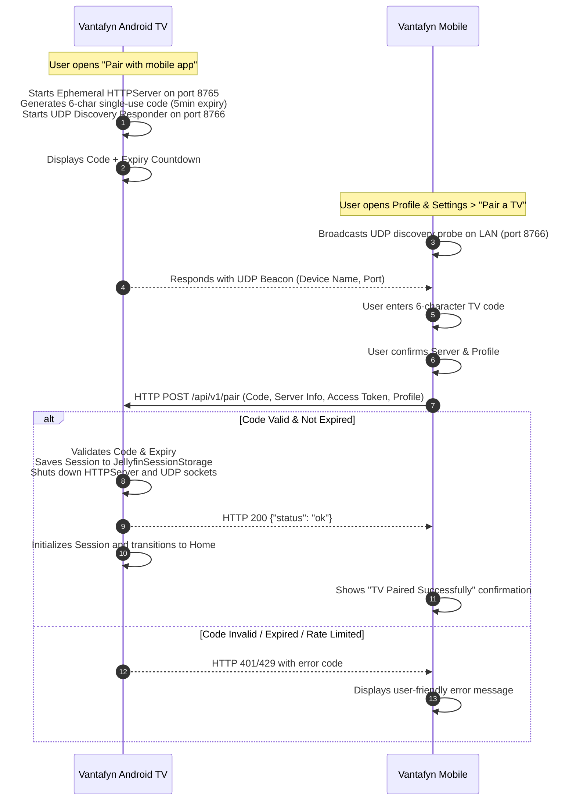

# Vantafyn Local Mobile-to-TV Pairing Architecture

## 1. Overview
The Vantafyn Mobile-to-TV pairing system enables users to set up a fresh Android TV installation without typing server URLs, usernames, or complex credentials using a remote control.

The implementation is **100% local, safe, and honest**:
- No external cloud services or intermediate signaling servers.
- No simulated/mock timers or fake animations.
- No user passwords transmitted or stored.
- Raw access tokens and secrets are never logged in Logcat or analytics.
- Manual TV sign-in remains completely functional as a permanent fallback.

---

## 2. Architecture & Protocol Sequence

---

## 3. Data Transfer Objects (DTOs)

### Payload Transferred from Mobile to TV (`TvPairingPayload`)
Only essential connection and profile metadata is sent over the local network:

| Field | Type | Description |
| :--- | :--- | :--- |
| `code` | `String` | 6-character pairing code entered by user |
| `serverUrl` | `String` | Base URL of the Jellyfin server |
| `localServerUrl` | `String?` | Optional local LAN server address |
| `remoteServerUrl` | `String?` | Optional WAN/remote server address |
| `serverName` | `String?` | Display name of the server |
| `serverVersion` | `String?` | Server software version |
| `serverId` | `String?` | Unique Jellyfin server ID |
| `userId` | `UUID` | User UUID |
| `userName` | `String` | Username |
| `userImageTag` | `String?` | Profile avatar image cache tag |
| `accessToken` | `String` | Active Jellyfin authentication token |
| `profileId` | `String` | Local profile identifier |
| `profileDisplayName`| `String` | Profile display name |
| `profileImageUrl` | `String?` | Profile avatar URL |
| `hasPassword` | `Boolean` | Whether profile requires password on switch |

> [!CAUTION]
> **Zero Password Policy**: Passwords, Ombi API keys, and server administration credentials are strictly excluded from the pairing payload.

---

## 4. Security & Expiration Model
1. **Single-Use Codes**: Once successfully paired, the pairing server terminates immediately.
2. **Short Expiration Window**: Codes expire after 300 seconds (5 minutes). A live countdown is rendered on TV.
3. **Brute-Force Protection**: After 4 failed attempts, the code is invalidated (`RATE_LIMITED`).
4. **Lifecycle-Aware Listener**: The TV HTTP server and UDP broadcast sockets run **only** while the `TvPairingScreen` is active. Navigating back or leaving the screen cancels all network listeners immediately.
5. **Keystore Storage**: When the TV receives the payload, the access token is stored using Android Keystore hardware encryption via `SharedPreferencesJellyfinSessionStorage`.

---

## 5. Error Handling & Recovery

| Failure Mode | TV Behavior | Mobile Behavior |
| :--- | :--- | :--- |
| **Code Expired** | Displays "Code Expired" notice; highlights "Refresh Code" button. | Displays "The pairing code on your TV has expired. Please refresh the code." |
| **Incorrect Code** | Increments fail counter; rejects request. | Displays "The TV rejected the code. Please check the code and try again." |
| **Too Many Attempts** | Code is locked; prompts user to generate a new code. | Displays "Too many failed attempts. Please generate a new code on your TV." |
| **Subnet Isolation / Router Drop** | Fallback subnet scanner probes active `/24` IPs. | Shows timeout notice suggesting checking Wi-Fi network. |
| **TV Exited Pairing** | Server stops; connections refused. | Displays "Couldn't reach your TV. Ensure pairing screen is open." |
