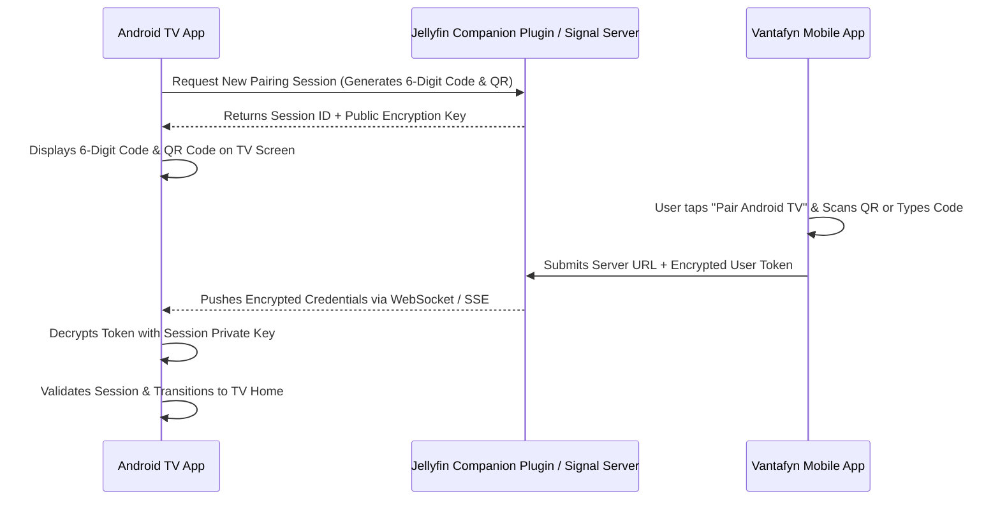

# Vantafyn TV Mobile Pairing Architecture (Future Roadmap)

## 1. Concept
To streamline initial TV onboarding, a future update will introduce a secure local/cloud pairing channel between the Vantafyn Mobile app and Vantafyn Android TV.

---

## 2. Security Requirements
1. **End-to-End Cryptography**: Ephemeral Diffie-Hellman / ECDH key exchange between TV and phone to prevent credential interception over local networks.
2. **Session Expiry**: Pairing codes must expire within 120 seconds.
3. **Explicit Confirmation**: Mobile user must confirm the target TV device name before sending access tokens.

---

## 3. Current Implementation Status
Because this protocol requires companion plugin support and cryptographic session negotiation, **no mock or fake pairing codes** are displayed in the current production build. Selecting "Pair with mobile app" directs users to manual sign-in with an informational notice.
