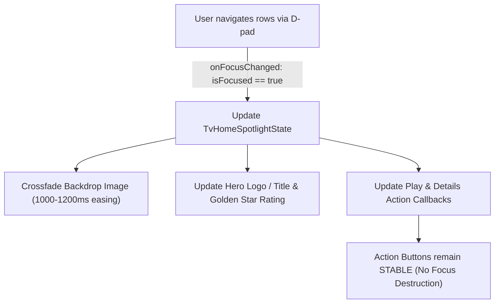

# Wholphin / Netflix Dynamic TV Spotlight & Navigation Audit

This document audits the conceptual architecture of 10-foot Android TV dynamic spotlight navigation (as implemented in Wholphin and Netflix), establishing the structural design principles for Vantafyn TV.

---

## 1. Architectural Model & Layering

In a 10-foot dynamic spotlight layout, the screen is organized into dedicated visual layers anchored at the root viewport:

```
+-------------------------------------------------------------------------+
| Layer 1: Vantafyn Ambient Foundation (Deep Cosmic Nebula Background)     |
+-------------------------------------------------------------------------+
| Layer 2: Pinned Spotlight Backdrop (Fixed at y=0, full width, DstIn)    |
+-------------------------------------------------------------------------+
| Layer 3: Spotlight Content Overlay (Title/Logo, Rating, Synopsis, Action) |
+-------------------------------------------------------------------------+
| Layer 4: Content Scroller (LazyColumn of Media Rows starting below hero)|
+-------------------------------------------------------------------------+
| Layer 5: Glass Navigation Rail (Pure Transparent Dark Glass Sidebar)     |
+-------------------------------------------------------------------------+
```

### Key Rules:
1. **Backdrop is Never a Scroll Item**: The backdrop image is anchored at absolute coordinates `y = 0` and is never placed inside a `LazyColumn`. Scrolling content rows never pushes or translates the backdrop image downward or upward in an uncoordinated manner.
2. **Dynamic Focus Synchronization**: When the user navigates through any content row via D-pad, focusing a card updates the active Spotlight item (`TvHomeSpotlightItem`), smoothly cross-fading the top backdrop and updating the title, logo, metadata badges (Gold Star, rating, runtime, year), overview, and action buttons.
3. **No Network Storms**: Spotlight updates use already-loaded metadata and image URLs attached to the focused item. No blocking Jellyfin HTTP calls are fired on cursor movement.

---

## 2. Dynamic Focus Flow



### Focus Restoration & Stability
- **Focus Drop Prevention**: Action buttons (`Play`, `Details`) maintain stable component identity. They are NOT wrapped in destructive recomposition containers (`Crossfade`) that destroy focused nodes, ensuring focus never gets dropped back into the sidebar.
- **Bi-directional Navigation**:
  - D-pad **Up** from the first content row shifts focus to the Hero Action buttons (`Play` / `Details`).
  - D-pad **Down** from the Hero Action buttons enters the first item of the topmost content row.
  - D-pad **Left** from any content row enters the Sidebar.
  - D-pad **Right** from the Sidebar returns focus to the active content item.

---

## 3. Sidebar Transparency & Seam Integration

- **Zero Blue Tint**: Completely eliminate heavy navy/blue gradient washes (`Color(0x66060A14)`, `Color(0x3B0D1527)`). The sidebar uses ultra-low alpha dark glass (`Color(0x18000000)` to `Color(0x28080A12)`).
- **Seamless Backdrop Extension**: The top hero artwork extends completely behind the translucent sidebar rail to `x = 0`, eliminating hard vertical split seams.
- **Single-Row Collapsed Actions**: When collapsed, secondary utilities (Search, Notifications, Exit) render as a single compact row/icon rather than taking excessive vertical height.
